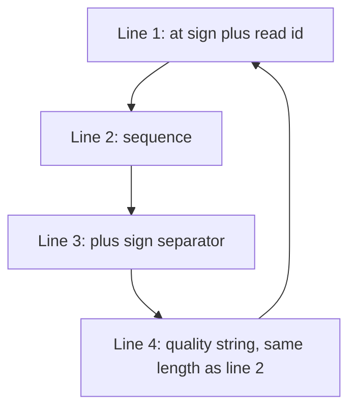
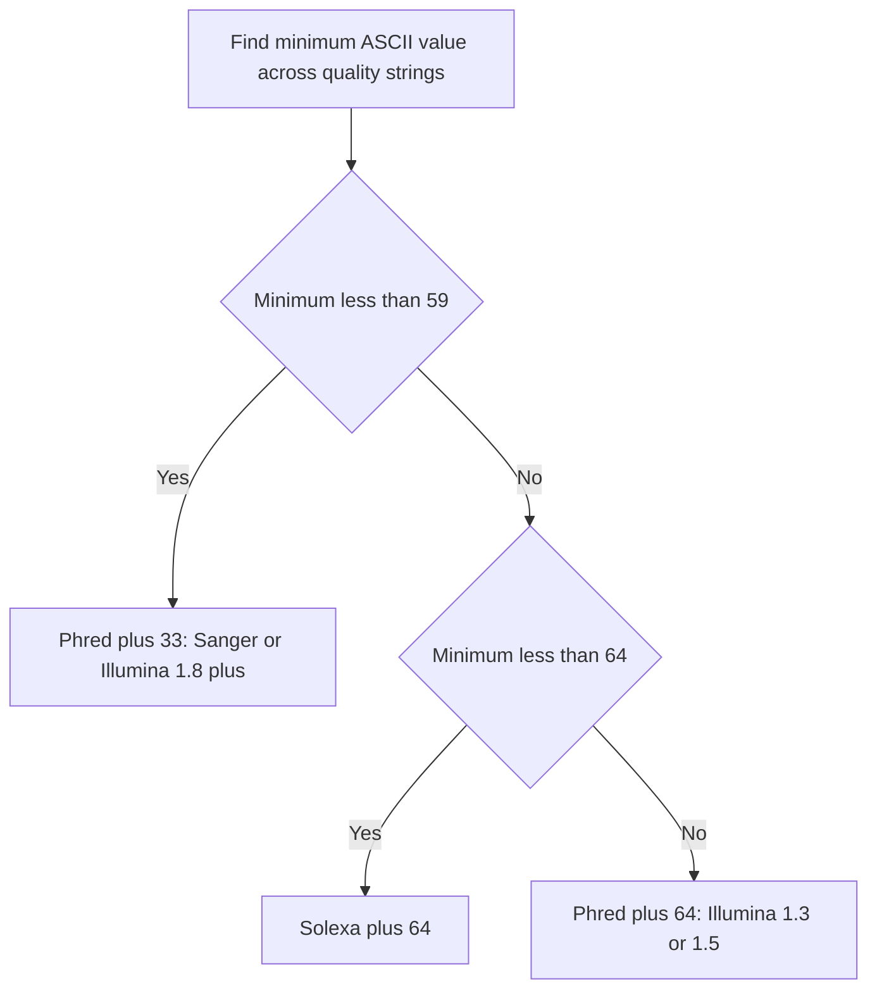

# Lecture 2 — FASTQ and Quality Scores

> **Duration:** ~2 hours of reading + hands-on.
> **Outcome:** You can parse a FASTQ file, convert Phred quality scores to error probabilities and back, recognize Sanger / Phred+33 vs Illumina 1.3 / Phred+64 encodings, trim reads on quality, and read a FastQC report critically.

If you only remember one thing from this lecture, remember this:

> **A FASTQ file is a FASTA file with one extra string per record: a per-base confidence score.** That extra string carries the entire QC story of your sequencing run. Every variant call, every alignment, every downstream interpretation rides on whether you read it correctly.

---

## 1. The format

A FASTQ record is exactly **four lines**:

```
@SRR1019034.1 read 1 length=35
GATCGGAAGAGCACACGTCTGAACTCCAGTCACAT
+
IIIIIIIIIIIIIIIIIIIIIII9IIIIIII<HBA
```

| Line | Starts with | Contents |
|------|-------------|----------|
| 1 | `@` | Read identifier — first whitespace token is the id, rest is description |
| 2 |     | The sequence — characters from `{A, C, G, T, N}` (occasionally lowercase) |
| 3 | `+` | Separator. Sometimes repeats the id from line 1. Usually empty. |
| 4 |     | Quality string — one ASCII character per base in line 2 |

That is it. Four lines, every time.

Two non-obvious points that bite people:

**1. The sequence and the quality string have the same length.** Always. If they don't, the file is malformed and your parser must fail loudly. A FASTQ in which `len(seq) != len(qual)` is the canonical "your downstream is about to silently shift by one base" disaster.

**2. The quality line can contain `@`.** ASCII `@` is decimal 64 — a valid quality character in both Phred+33 (Q31, very high) and Phred+64 (Q0, very low). This means **you cannot split a FASTQ file on `@`**. You must count lines in groups of four. This is why every robust FASTQ parser counts lines, never splits on a delimiter.


*A FASTQ record is a fixed cycle of four lines — a robust parser counts lines, it never splits on the at sign.*

Cock et al. 2010 (*NAR* 38:1767) formalized the FASTQ specification — almost twenty years after the format had been in production use. That gap (years of "everyone agrees but it's not written down") explains the encoding zoo we discuss in §4.

---

## 2. Phred quality scores: the math

A **Phred quality score** Q is a logarithmic measure of base-call confidence:

```
Q = -10 * log10(P_error)
```

So:

| Q  | P_error    | 1 in N      | Plain English             |
|---:|-----------:|------------:|---------------------------|
| 10 | 0.1        | 1 in 10     | 90% confident             |
| 20 | 0.01       | 1 in 100    | 99% confident             |
| 30 | 0.001      | 1 in 1,000  | 99.9% confident — the Illumina Q30 spec |
| 40 | 0.0001     | 1 in 10,000 | 99.99% confident          |
| 50 | 0.00001    | 1 in 100,000 | PacBio HiFi territory    |
| 60 | 0.000001   | 1 in 1,000,000 | Mostly consensus calls |

The formula is from Ewing & Green's 1998 *Genome Research* paper on the **Phred** base-caller for Sanger sequencing. Phred scores were calibrated against known-truth datasets — when Phred says Q30, empirically about 1 in 1,000 bases at that score were wrong. This calibration is what makes the score *meaningful* rather than ordinal.

In Python:

```python
import math

def q_to_p(q: int) -> float:
    return 10 ** (-q / 10)

def p_to_q(p: float) -> float:
    return -10 * math.log10(p)
```

That's the whole math. Memorize Q20 ↔ 1%, Q30 ↔ 0.1%, Q40 ↔ 0.01% and you are done.

### Why log?

Two reasons. First, **error rates span orders of magnitude** — a single sequencing run produces some bases at P=0.5 (Q3) and some at P=0.0001 (Q40). A log scale puts both in a one-byte ASCII range. Second, **errors compound multiplicatively** along a read: if two adjacent bases have independent error probabilities P1 and P2, the probability that both are correct is (1-P1)(1-P2). Working in log space turns the multiplication into addition, which keeps numerical stability in long aggregations.

---

## 3. ASCII encoding — the Phred+33 trick

We need to serialize Q values as **one byte per base** so that line 4 of a FASTQ record has the same length as line 2. A single byte is 256 values, which is more than enough for Q in the realistic range of 0–60.

The trick: add an **offset** to Q so the result falls in a printable ASCII range, then store the resulting character.

```
ascii_code = Q + offset
```

With **offset 33** (the modern Sanger / Illumina 1.8+ standard):

| Q  | ASCII code | Character |
|---:|-----------:|:----------|
| 0  | 33         | `!`       |
| 10 | 43         | `+`       |
| 20 | 53         | `5`       |
| 30 | 63         | `?`       |
| 40 | 73         | `I`       |

So a quality string like `IIIIIIII` means "eight bases at Q40." A quality string like `!!!!!!!!` means "eight bases at Q0 — total junk."

To convert:

```python
def char_to_phred33(ch: str) -> int:
    return ord(ch) - 33

def phred33_to_char(q: int) -> str:
    return chr(q + 33)
```

This is the most-used four lines of code in short-read bioinformatics.

---

## 4. The encoding zoo (and why this used to matter)

Between roughly 2004 and 2011, the field had **five different quality encodings** in active use. They all looked like ASCII quality strings. They were not mutually compatible. Mistaking one for another shifted every Q value by 31, silently destroying any downstream filter or trim.

| Encoding         | Offset | Phred range | Era / produced by |
|------------------|-------:|------------:|------------------|
| Sanger / Phred+33 | 33     | 0–93        | Sanger (1990s onward), Roche 454, modern de facto standard |
| Solexa+64        | 64     | -5–62       | 2004–2006, pre-Illumina-acquisition Solexa machines |
| Illumina 1.3+    | 64     | 0–62        | Illumina GA, 2009–2010 |
| Illumina 1.5+    | 64     | 3–62 (with quirky 'B' tag) | Illumina HiSeq, 2009–2011 |
| Illumina 1.8+    | 33     | 0–41        | 2011 onward — now standard |

**The Solexa scoring** (offset 64) was actually a different formula — `Q_solexa = -10 * log10(P/(1-P))` rather than the Phred `-10 log10(P)`. The values converge for high Q and diverge for Q < 10. Conversion tables exist; Biopython's `Bio.SeqIO.QualityIO.solexa_quality_from_phred` does it. You will hit a Solexa-encoded file roughly once per career, and you will be glad you knew it existed.

**Illumina 1.5+** has the additional wart that Illumina marked low-confidence reads with a quality character of `B` (Q2 in Phred+64) at the 3' end of the read — they were calibrated to mean "this base is unreliable, trim me." Bowtie 1 and BWA both had explicit Illumina-1.5 modes for this.

**Illumina 1.8+** moved back to Phred+33 in August 2011 with the CASAVA 1.8 pipeline release. That is the encoding you will see in essentially every FASTQ file produced from 2012 onward.

### Detecting the encoding programmatically

If you do not know the encoding, the trick is to look at the **lowest ASCII value** in the quality strings:

```python
def detect_encoding(qual_strings: list[str]) -> str:
    """Heuristic: peek at minimum ASCII to guess offset."""
    if not qual_strings:
        return "unknown"
    min_ascii = min(ord(c) for q in qual_strings for c in q)
    if min_ascii < 59:
        return "Phred+33"        # Sanger / Illumina 1.8+
    elif min_ascii < 64:
        return "Solexa+64"
    else:
        return "Phred+64"        # Illumina 1.3 / 1.5
```

The boundary `< 59` works because the lowest plausible Phred+33 character is `!` (Q0) and the lowest plausible Phred+64 character is `@` (Q0) — ASCII 64. Any character below ASCII 59 (`;`) cannot be Phred+64. Anything above ASCII 73 (`I`) cannot be Phred+33 for *real* Illumina data (which caps at Q41). Sample a few thousand records before deciding.


*The encoding-detection heuristic: bucket by the lowest ASCII quality character observed.*

In Biopython:

```python
# parse with Phred+33 (the default)
for record in SeqIO.parse("reads.fastq", "fastq"):
    pass

# parse with the older Phred+64 encoding
for record in SeqIO.parse("legacy.fastq", "fastq-illumina"):
    pass
```

The `fastq-illumina` format is Phred+64 (Illumina 1.3+/1.5+). The `fastq-solexa` format is Solexa+64 with the alternate scoring formula. The default `fastq` is Phred+33 (Sanger / modern Illumina).

---

## 5. Reading FASTQ with Biopython

```python
from Bio import SeqIO

for record in SeqIO.parse("reads.fastq", "fastq"):
    print(record.id)
    print(record.seq)
    quals = record.letter_annotations["phred_quality"]
    print(quals)         # list[int], one entry per base
    print(sum(quals) / len(quals))   # mean Phred quality of this read
```

Three things to notice:

1. **The quality scores are integers**, already decoded from ASCII. You do not need to call `ord(c) - 33` yourself; Biopython has done it.
2. **They live in `record.letter_annotations`**, a special dict whose keys are per-letter annotations. This is what makes a `SeqRecord` parsed from FASTQ different from one parsed from FASTA.
3. **The list is the same length as `record.seq`**. If you mutate `record.seq` (for example by trimming) you must mutate `letter_annotations["phred_quality"]` in parallel, or Biopython will refuse to write the record.

Writing FASTQ:

```python
from Bio import SeqIO
SeqIO.write(filtered_records, "filtered.fastq", "fastq")
```

The output is always Phred+33. If your input was Phred+64, the conversion happens automatically.

---

## 6. Read trimming on quality

Most sequencers produce reads whose quality **decays at the 3' end**. Illumina is the canonical example: the first 25 bases of a 150-bp read are typically Q35+, the last 30 are often Q20 or worse. Variant callers and aligners do better on cleaner input, so the standard practice is to **trim the low-quality tail** before downstream analysis.

Two common heuristics:

### Hard 3' cut

Trim a fixed number of bases off the 3' end of every read.

```python
def trim_fixed(seq: str, quals: list[int], n: int) -> tuple[str, list[int]]:
    return seq[:-n], quals[:-n]
```

Simple, deterministic, easy to reason about. Wasteful when the run has variable quality drop-off per read.

### Sliding window

Slide a window (typically 4 bp) along the read; cut when the **mean Phred quality in the window drops below a threshold** (typically Q20).

```python
def trim_sliding(quals: list[int], window: int = 4, threshold: int = 20) -> int:
    """Return the position at which to truncate."""
    for i in range(len(quals) - window + 1):
        mean_q = sum(quals[i:i+window]) / window
        if mean_q < threshold:
            return i
    return len(quals)
```

This is what **Trimmomatic** (Bolger et al., 2014, *Bioinformatics* 30:2114) does by default with `SLIDINGWINDOW:4:20`. It is the field's de facto default. Use it. Cite it.

### Filtering whole reads

After trimming, you usually also discard reads that are now too short to be useful (commonly `< 36 bp` for human variant calling, since alignment quality on very short reads is poor) or whose **mean post-trim quality** is below a threshold (commonly `Q20`).

We will do all three — hard cut, sliding window, mean-quality filter — in [Exercise 3](../exercises/exercise-03-filter-by-quality.py).

---

## 7. FastQC — the canonical QC tool

**FastQC** (Andrews, S., 2010, Babraham Institute) is the field's standard read-QC tool. Given a FASTQ file, it produces an HTML report with 11 modules. You will see this report in every paper that does sequencing.

Install:

```bash
conda install -c bioconda fastqc=0.12.1
```

Run:

```bash
fastqc reads.fastq -o fastqc_output/
```

This produces `fastqc_output/reads_fastqc.html` (the report) and `fastqc_output/reads_fastqc.zip` (the raw data behind the report). Open the HTML in a browser.

The 11 modules, in the order they appear, with a one-line summary of each:

1. **Basic Statistics** — record count, read length distribution, %GC. Always read this.
2. **Per base sequence quality** — boxplot of Phred quality at each base position. Look for 3' decay.
3. **Per tile sequence quality** — Illumina-specific; flags physical flowcell-tile problems.
4. **Per sequence quality scores** — distribution of mean per-read quality. The peak should be Q30+.
5. **Per base sequence content** — should be roughly flat lines for A, C, G, T. The first 10–15 bases often show non-uniform content due to library priming; this is normal and not a problem.
6. **Per sequence GC content** — should be roughly Gaussian. A second peak means contamination (often adapter or another species).
7. **Per base N content** — should be near zero everywhere. Spikes mean trouble.
8. **Sequence length distribution** — should be a sharp peak at the run length. Variable lengths post-trimming are fine; pre-trimming they're suspicious.
9. **Sequence duplication levels** — fraction of reads with identical sequences. High duplication suggests low library complexity.
10. **Overrepresented sequences** — exact sequences that occur > 0.1% of reads. Adapters are the usual culprit.
11. **Adapter content** — checks for known adapter sequences (TruSeq, Nextera, etc.) along the read.

FastQC marks each module as **pass / warn / fail** with a coloured icon. The icons are calibrated for **standard Illumina whole-genome shotgun**. They are not always meaningful for other library types:

- An RNA-seq library will fail "Per base sequence content" at positions 1–15 because of random-hexamer priming bias. This is normal.
- A small-RNA library will fail "Sequence length distribution" because miRNAs are intentionally short. This is normal.
- An amplicon library will fail "Sequence duplication" because amplicons are intentionally duplicated. This is normal.

**Read the icons critically, not credulously.** A "fail" is a flag for "look at this module"; it is not a verdict that your data is bad. In the mini-project we will produce a FastQC report and write a one-page interpretation that distinguishes real problems from cosmetic ones.

---

## 8. Streaming vs in-memory parsing

A single human whole-genome sequencing FASTQ at 30x coverage is roughly **30–50 GB uncompressed**. You will not load it into RAM. You will not even unzip it to disk — you will pipe it through your processing while it stays gzipped.

Biopython 1.83 transparently handles `.fastq.gz` files via `gzip.open`:

```python
import gzip
from Bio import SeqIO

with gzip.open("reads.fastq.gz", "rt") as handle:
    for record in SeqIO.parse(handle, "fastq"):
        # process one record at a time
        pass
```

The `"rt"` mode opens the gzip stream in **text** mode, which is what `SeqIO.parse` needs. Without `"rt"`, you'd get bytes and Biopython would refuse.

The streaming pattern — **read one record, process, emit, discard** — is the *only* viable pattern for production-scale FASTQ. We use it throughout this week, the mini-project, and Weeks 5 and 6 of the course.

If you find yourself writing `records = list(SeqIO.parse(...))` on a real FASTQ file, **stop**. You are loading the whole thing into RAM. Refactor to a generator. The Challenge for this week ([streaming-large-fasta](../challenges/challenge-01-streaming-large-fasta.md)) builds this muscle explicitly.

---

## 9. Common gotchas

**Trimming sequence but forgetting quality.** A `SeqRecord` from FASTQ holds two parallel arrays: `record.seq` (the bases) and `record.letter_annotations["phred_quality"]` (the qualities). Slicing `record.seq[:30]` does *not* slice the qualities. You must slice both, in lockstep. Biopython's `record[:30]` syntax does this correctly — prefer it.

**Mistaking `@` in the quality string for a record boundary.** ASCII `@` is Phred+33 Q31, a perfectly normal quality character. A FASTQ parser that splits on `@` instead of counting lines will fail randomly on real data. Always count lines in groups of four.

**Mixing Phred+33 and Phred+64 mid-pipeline.** If your tool emits Phred+33 and the next tool in your pipeline expects Phred+64 (or vice versa), every Q value is shifted by 31. The pipeline will run, the output will be plausible, and your downstream variant calls will be silently wrong. Always pin and document the encoding at every step.

**Single-end vs paired-end.** Most Illumina runs produce *two* FASTQ files per sample — `_R1.fastq.gz` and `_R2.fastq.gz` — one for each end of a paired-end read. The two files must stay in sync, and most aligners require them in matching order. We meet this in Week 5; for Week 2, just know it exists.

**Different reads having different lengths.** Older Illumina runs and all long-read platforms (PacBio, Nanopore) produce reads of variable length. Code that assumes a fixed read length is brittle. Always check; never hard-code.

---

## 10. Recap and what's next

You should now be able to:

- Parse a FASTQ file with `SeqIO.parse(handle, "fastq")` and access per-base Phred qualities.
- Convert between Phred Q and error probability P, in both directions.
- Detect Phred+33 vs Phred+64 from the minimum ASCII character in the quality strings.
- Trim reads with a sliding-window quality heuristic; filter on length and mean quality.
- Run FastQC and interpret its eleven modules — distinguishing real problems from cosmetic ones.
- Stream a gzipped FASTQ without loading it into RAM.

Next: in the **exercises**, you will re-parse last week's FASTA with Biopython, plot the per-base quality profile of a real FASTQ, and build a quality-filter that produces a clean output FASTQ. The **mini-project** then asks you to put it all together on a real 1000 Genomes subset.

Go to [exercises/](../exercises/) when you are ready.

---

*Return to [Lecture 1 — FASTA: the line format that won](./01-fasta-the-line-format.md), or jump back to the [Week 2 README](../README.md).*
