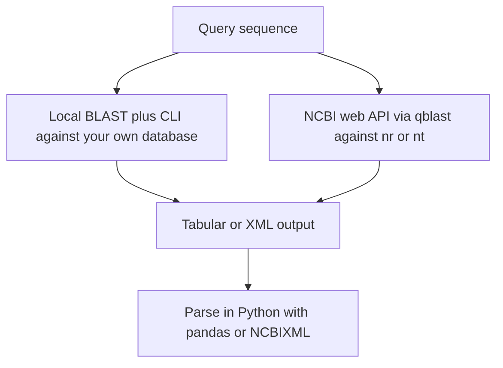

# Lecture 2 — Running BLAST Locally and via NCBI

> **Duration:** ~3 hours of reading + hands-on command-line + Python.
> **Outcome:** You can install BLAST+ 2.15, build a local nucleotide database from a FASTA file with `makeblastdb`, run `blastn`/`blastp`/`tblastn` against it from the command line, submit the same query to NCBI via `Bio.Blast.NCBIWWW.qblast` and parse the result, choose the right output format for the next step in your pipeline, and explain in one sentence each what E-value, bit score, and percent identity tell you about a hit.

Lecture 1 was the conceptual layer — what BLAST does and why it is fast. Lecture 2 is the operational layer: how you actually run it on your machine and on NCBI's servers, and how you read the output.

If you only remember one thing from this lecture, remember this:

> **BLAST is two interfaces wearing the same algorithm: the command-line BLAST+ suite for local databases (fast, reproducible, requires `makeblastdb` setup) and the NCBI web API for remote queries against `nr`/`nt` (slow, queued, requires no setup). The Biopython 1.83 wrappers give you both from Python — `Bio.Blast.Applications` for the local CLI and `Bio.Blast.NCBIWWW` for the web service. Pick the interface that matches your scale.**

You will use both in this week's exercises. The local interface for fast iteration on a small curated database (Exercise 2, mini-project). The web interface for one-shot queries against the public databases when you do not have local copies (Exercise 1, mini-project's full classifier run).


*Same seed-and-extend algorithm underneath, two very different interfaces for reaching it.*

---

## 1. Installing BLAST+

The NCBI BLAST+ suite is a set of command-line tools written in C++. It is mature, well-documented, and the reference implementation that every other aligner is benchmarked against. Install via conda (recommended) or from the NCBI installer.

### 1.1 With conda (recommended)

```bash
# Add the bioconda channel once.
conda config --add channels bioconda
conda config --add channels conda-forge

# Create an environment for Week 4.
conda create -n c10-week-04 python=3.11 biopython=1.83 pandas blast=2.15
conda activate c10-week-04

# Sanity check.
blastn -version
# blastn: 2.15.0+
# Package: blast 2.15.0, build Oct 31 2023 14:13:26

makeblastdb -version
# makeblastdb: 2.15.0+
```

### 1.2 From the NCBI installer

If you prefer not to use conda, the standalone installers are at <https://ftp.ncbi.nlm.nih.gov/blast/executables/blast+/2.15.0/>. Pick the package for your OS (`.dmg` for macOS, `.exe` for Windows, `.tar.gz` for Linux), install, and add the `bin/` directory to your `PATH`.

### 1.3 What you just installed

The BLAST+ suite is ~15 executables. The ones you will use this week:

| Tool | Role |
|------|------|
| `makeblastdb` | Build a BLAST database from a FASTA file |
| `blastn` | Nucleotide query against nucleotide database |
| `blastp` | Protein query against protein database |
| `tblastn` | Protein query against translated nucleotide database |
| `blastx` | Translated nucleotide query against protein database |
| `blastdbcmd` | Inspect a BLAST database; extract sequences or metadata |
| `update_blastdb.pl` | Download or update prebuilt NCBI databases |

Everything else (`rpsblast`, `psiblast`, `deltablast`, `legacy_blast.pl`, ...) is out of scope for this week.

---

## 2. Building a local database with `makeblastdb`

### 2.1 The minimum command

You have a FASTA file `references.fasta`. You want to query nucleotide sequences against it.

```bash
makeblastdb \
    -in references.fasta \
    -dbtype nucl \
    -out references_db \
    -parse_seqids
```

This produces six files in the current directory:

```
references_db.ndb     # database metadata
references_db.nhr     # header info
references_db.nin     # sequence index
references_db.not     # taxonomy info (if available)
references_db.nsq     # packed sequences
references_db.ntf     # mask info
references_db.nto     # offset info
```

For a protein database, change `-dbtype nucl` to `-dbtype prot` and the file extensions become `.phr`, `.pin`, `.psq`, etc. The `-parse_seqids` flag tells `makeblastdb` to extract the sequence IDs from the FASTA headers and make them addressable via `blastdbcmd -entry <id>` — useful when you need to pull a specific subject sequence out of the database after a hit.

### 2.2 Taxonomy-aware databases

If you want BLAST to return the taxonomy ID of each hit, you need to associate every database entry with a taxon ID at build time. Two options:

**(a) `-taxid <int>`** — assign a single taxon ID to *every* sequence in the FASTA. Useful when the FASTA is from a single organism (e.g., a chromosome of *E. coli*, taxid 562).

```bash
makeblastdb \
    -in ecoli_genome.fasta \
    -dbtype nucl \
    -out ecoli_db \
    -taxid 562 \
    -parse_seqids
```

**(b) `-taxid_map <file>`** — supply a tab-separated mapping `<seqid>\t<taxid>` for each sequence in the FASTA. Used when your FASTA contains sequences from many organisms.

```
NR_117741.1    1280
NR_117742.1    287
NR_117743.1    562
NR_117744.1    1396
...
```

The mini-project uses option (b) on the 16S rRNA database to build a taxonomy-aware classifier.

### 2.3 Inspecting a database

```bash
# Summary.
blastdbcmd -db references_db -info
# Database: references.fasta
#         1,234 sequences; 4,567,890 total bases
# Date: Jan 15, 2026  Longest sequence: 12,345 bases
# BLASTDB Version: 5

# Pull a specific sequence.
blastdbcmd -db references_db -entry "NR_117741.1" -outfmt "%f"

# List all sequence IDs.
blastdbcmd -db references_db -entry "all" -outfmt "%a"
```

`%f` prints FASTA; `%a` prints accession only. The full list of format specifiers is in the BLAST+ user manual.

---

## 3. Running `blastn` against a local database

Once the database is built, the query syntax is the same regardless of whether the database is local or one of NCBI's prebuilt databases.

### 3.1 The minimum command

```bash
blastn \
    -query query.fasta \
    -db references_db \
    -out results.txt \
    -evalue 1e-5 \
    -outfmt 6
```

This produces a tab-separated output with one row per HSP and the default 12 columns:

```
query_001  NR_117741.1  98.5  1247   18   2   3  1247  142  1388  4.2e-321  2241
query_001  NR_117742.1  87.3   245   28   3  1003 1245    1  244  1.1e-67    245
query_002  NR_117743.1  99.1  1352   12   1   1  1352   25 1376  0.0e+00    2487
...
```

Columns: `qseqid`, `sseqid`, `pident`, `length`, `mismatch`, `gapopen`, `qstart`, `qend`, `sstart`, `send`, `evalue`, `bitscore`. (See `resources.md` for the full reference.)

### 3.2 Picking a `-task`

`blastn` has four sub-tasks, optimized for different sensitivity regimes:

```bash
# Default. For sequences >= 95% identical. Word size 28, exact seeds.
blastn -task megablast -query q.fa -db db -out r.txt

# More sensitive. For sequences 80-95% identical. Word size 11.
blastn -task blastn -query q.fa -db db -out r.txt

# Discontiguous megablast. Spaced seed pattern, more sensitive than blastn
# but faster than blastn. Word size 11.
blastn -task dc-megablast -query q.fa -db db -out r.txt

# For very short queries (< 30 bp), like primers.
blastn -task blastn-short -query q.fa -db db -out r.txt
```

Rule of thumb: start with `megablast` (the default) for self-vs-self or highly-similar comparisons; switch to `blastn` if you suspect divergence > 5%. For the mini-project's 16S classifier, `blastn` (not `megablast`) is appropriate because the query sequences are from a range of bacterial genera and may have only 85–95% identity to the closest 16S reference.

### 3.3 Picking an `-outfmt`

The most common values:

| `-outfmt` | What you get |
|----------:|--------------|
| `0` | Default human-readable pairwise alignment view |
| `5` | XML (parseable with `Bio.Blast.NCBIXML`) |
| `6` | Tab-separated, no header (one row per HSP) |
| `7` | Tab-separated, with `#` comment-line headers |
| `10` | CSV |
| `"6 std staxid sscinames"` | Tabular with custom columns added — taxon ID and scientific name here |

For pipeline use, `outfmt 6` (or 7) with custom columns is the most useful. For richer parsing in Python, use `outfmt 5` (XML) and `Bio.Blast.NCBIXML`.

### 3.4 The most useful options

```bash
blastn \
    -query query.fasta \
    -db references_db \
    -out results.tsv \
    -outfmt "6 qseqid sseqid pident length evalue bitscore staxid sscinames stitle" \
    -evalue 1e-5 \
    -max_target_seqs 10 \
    -max_hsps 1 \
    -num_threads 4 \
    -task blastn
```

- `-max_target_seqs 10` — report up to 10 distinct subject sequences per query.
- `-max_hsps 1` — report only the highest-scoring HSP per (query, subject) pair (useful when subjects can have multiple HSPs and you only care about the best).
- `-num_threads 4` — parallelize over 4 CPU cores.
- `-perc_identity <float>` — filter by percent identity at the BLAST level (faster than post-filtering in pandas).
- `-qcov_hsp_perc <float>` — filter by query coverage of the HSP.

---

## 4. Running `blastp` and `tblastn`

`blastp` is the protein analog of `blastn`. Syntax is identical; the database must have been built with `-dbtype prot`.

```bash
blastp \
    -query protein_query.fasta \
    -db swissprot_db \
    -out results.tsv \
    -outfmt 6 \
    -evalue 1e-5 \
    -matrix BLOSUM62 \
    -word_size 3 \
    -num_threads 4
```

The most-tuned flags for `blastp`:

- `-matrix` — substitution matrix. Default `BLOSUM62`. Use `BLOSUM45` for distant homology, `BLOSUM80` for close homology, `PAM30` for short peptides (~10 residues).
- `-word_size` — `W`. Default 3. Lower is more sensitive (and *much* slower); 2 is the floor.
- `-threshold` — neighborhood threshold `T`. Default 11 for BLOSUM62.
- `-comp_based_stats` — composition-based statistics (1 or 2; default 2). Adjusts E-values for biased composition. Leave at default.

### 4.1 `tblastn` — protein query, translated nucleotide database

`tblastn` translates *the database* into all six reading frames at search time, then runs `blastp`-style search against the translated database. Use it when:

- You have a protein query (e.g., a kinase you found in another organism).
- You want to know if it is encoded in an unannotated genome.
- The genome has not been annotated yet — there is no protein database to search against.

```bash
tblastn \
    -query my_kinase.fasta \
    -db unannotated_genome_db \
    -out kinase_hits.tsv \
    -outfmt "6 qseqid sseqid pident length evalue bitscore qframe sframe" \
    -evalue 1e-10 \
    -db_gencode 1
```

The `-db_gencode` flag is the genetic code used to translate the database. `1` is the standard nuclear code; `2` is the vertebrate mitochondrial code; `11` is the bacterial code. The full table is at <https://www.ncbi.nlm.nih.gov/Taxonomy/Utils/wprintgc.cgi>.

`sframe` in the output (the subject frame) tells you which of the six reading frames (`+1, +2, +3, -1, -2, -3`) the hit is in.

### 4.2 `blastx` — translated nucleotide query, protein database

The mirror image of `tblastn`. Use when:

- You have an unannotated DNA sequence (e.g., a contig from a metagenomics assembly).
- You want to identify the proteins it encodes by searching against a curated protein database.

```bash
blastx \
    -query contig.fasta \
    -db swissprot_db \
    -out contig_proteins.tsv \
    -outfmt 6 \
    -evalue 1e-5
```

---

## 5. Querying NCBI BLAST via `Bio.Blast.NCBIWWW`

When you do not want to download the database — `nr` is ~300 GB, `nt` is ~500 GB — query NCBI's web BLAST service instead. The Biopython 1.83 wrapper is `Bio.Blast.NCBIWWW.qblast`.

### 5.1 The minimum call

```python
from Bio import Entrez, SeqIO
from Bio.Blast import NCBIWWW, NCBIXML

Entrez.email = "you@example.com"   # required by NCBI ToS

# Read the query.
query = SeqIO.read("query.fasta", "fasta")

# Submit. This call blocks until NCBI responds (10s to several minutes).
result_handle = NCBIWWW.qblast(
    program="blastn",
    database="nt",
    sequence=str(query.seq),
    expect=1e-10,
    hitlist_size=20,
    megablast=True,
)

# Parse.
blast_record = NCBIXML.read(result_handle)

# Iterate.
for alignment in blast_record.alignments[:5]:
    best_hsp = alignment.hsps[0]
    print(
        f"{alignment.accession}  {alignment.title[:60]:60s}  "
        f"E={best_hsp.expect:.2e}  bit={best_hsp.bits:.0f}  "
        f"id={best_hsp.identities}/{best_hsp.align_length}"
    )
```

### 5.2 The arguments you will actually use

```python
NCBIWWW.qblast(
    program="blastn",          # "blastn", "blastp", "tblastn", "blastx", "tblastx"
    database="nt",             # "nt", "nr", "refseq_rna", "refseq_protein",
                               # "swissprot", "16S_ribosomal_RNA", ...
    sequence=str(query.seq),   # the query, as a string or FASTA-text
    expect=1e-10,              # E-value cutoff
    hitlist_size=50,           # max number of hits to return
    megablast=True,            # for blastn, use megablast (faster, less sensitive)
    word_size=11,              # override the default word size
    matrix_name="BLOSUM62",    # for protein searches
    nucl_reward=1,             # blastn match reward (default 1)
    nucl_penalty=-2,           # blastn mismatch penalty (default -2)
    gapcosts="5 2",            # gap_open and gap_extend, space-separated
    filter="L",                # low-complexity filtering: "L" on, "F" off
    format_type="XML",         # always XML for programmatic use; default is XML
)
```

### 5.3 Caching the result

`NCBIWWW.qblast` returns a `StringIO`-like handle. **Read it once and save to disk** — you cannot rewind it, and re-querying NCBI for the same input is wasteful and rude.

```python
xml_path = "results/query1.blast.xml"
with open(xml_path, "w") as f:
    f.write(result_handle.read())

# Later: re-read from disk without hitting the network.
with open(xml_path) as f:
    blast_record = NCBIXML.read(f)
```

The mini-project's classifier caches every BLAST result to disk on first run. The second run reads from the cache. This is non-optional for any code that does more than three BLAST queries.

### 5.4 Rate limits and etiquette

Quoting NCBI's policy verbatim from <https://www.ncbi.nlm.nih.gov/books/NBK25497/>:

> Do not contact the server more often than once every three seconds. Run scripts on weekends or between 9 pm and 5 am EST on weekdays for any series of more than 100 requests.

Biopython 1.83 enforces the 3-second delay automatically when `Entrez.email` is set. If you do not set `Entrez.email`, the call still works but you are not identifiable, and NCBI may block your IP if you cause problems. **Always set `Entrez.email`.**

For more than ~100 calls per session, register for a free NCBI API key (`Entrez.api_key = "..."`) and the rate goes up to 10/second.

---

## 6. Parsing BLAST output

Three formats, three Python parsers, three use cases.

### 6.1 Tabular (`-outfmt 6` / `-outfmt 7`) with pandas

```python
import pandas as pd

cols = [
    "qseqid", "sseqid", "pident", "length", "mismatch",
    "gapopen", "qstart", "qend", "sstart", "send",
    "evalue", "bitscore",
]
df = pd.read_csv("results.tsv", sep="\t", names=cols)

# Top hit per query by lowest E-value.
top = df.sort_values(["qseqid", "evalue"]).groupby("qseqid").first()

# Filter to high-confidence hits.
strong = df[(df["evalue"] < 1e-50) & (df["pident"] > 95.0)]
```

For custom `-outfmt "6 ..."` you must adjust the column names to match the flags you passed.

### 6.2 XML (`-outfmt 5`) with `Bio.Blast.NCBIXML`

```python
from Bio.Blast import NCBIXML

with open("results.xml") as f:
    # For a single query: read()
    # For multiple queries: parse() and iterate
    blast_record = NCBIXML.read(f)

for alignment in blast_record.alignments:
    for hsp in alignment.hsps:
        print(f"{alignment.accession}  E={hsp.expect}  bits={hsp.bits}")
        print(f"  Query: {hsp.query[:60]}")
        print(f"  Match: {hsp.match[:60]}")
        print(f"  Sbjct: {hsp.sbjct[:60]}")
```

The `BlastRecord` object has `.query`, `.query_length`, `.database`, `.database_length`, and `.alignments` (a list). Each `Alignment` has `.accession`, `.title`, `.length`, and `.hsps` (a list). Each `HSP` has `.score`, `.bits`, `.expect`, `.identities`, `.positives`, `.gaps`, `.align_length`, `.query_start`, `.query_end`, `.sbjct_start`, `.sbjct_end`, `.query`, `.match`, `.sbjct`.

### 6.3 Multi-query XML — `NCBIXML.parse`

For a multi-query input FASTA, `qblast` (and the local CLI with `outfmt 5`) returns concatenated `<BlastOutput>` records. Use `parse`, not `read`:

```python
from Bio.Blast import NCBIXML

with open("results.xml") as f:
    for blast_record in NCBIXML.parse(f):
        # blast_record.query is the query sequence ID.
        if blast_record.alignments:
            top = blast_record.alignments[0]
            print(f"{blast_record.query} -> {top.accession}")
```

The mini-project uses this exact pattern for its ~20 unknown sequences.

---

## 7. Reading E-values, bit scores, and percent identity correctly

Three numbers, three meanings. Lecture 1 covered the theory; here is the operational summary.

### 7.1 E-value

The **expected number of hits at this score or better** in a database this size under the K-A null. A small E-value is evidence against the null. Not a probability of correctness.

```
top_hit.expect = 4.2e-87
```

means: in a search against this database, under random-residue null, we would expect ~4 × 10^-87 hits at score ≥ this. That is effectively zero — the hit is not chance.

### 7.2 Bit score

The **database-size-independent** normalization of the raw score. Comparable across searches. A bit score of 80 means the hit is `2^80` ≈ 10^24 less likely than chance — regardless of how big the database is.

```
top_hit.bits = 2241.0
```

is "essentially impossible by chance". Bit scores ≥ 50 are confidently homologous; < 40 is noise.

### 7.3 Percent identity

The fraction of aligned positions (excluding gaps) where query and subject match. Computed by BLAST as `pident = identities / align_length × 100`. **Includes gaps in the denominator** if `align_length` is the gapped alignment length, which it is in BLAST tabular output. Different tools compute "percent identity" differently; do not compare numbers across tools without reading their definitions.

For taxonomy work, the rough biological thresholds at the 16S rRNA level are:

| % identity | Implication |
|-----------:|-------------|
| > 98.7 | Same species (Stackebrandt & Ebers 2006 threshold) |
| 94–98.7 | Same genus |
| 85–94 | Same family |
| < 85 | Higher than family — usually unreliable for species-level identification |

These thresholds are 16S-specific. For *whole-genome* identity, the corresponding ANI (average nucleotide identity) thresholds are 95% for species and ~85% for genus.

---

## 8. A worked end-to-end run

You will do this exact run on Wednesday with your own query. Here it is laid out start to finish.

**Input:** an unknown ~1400 bp 16S rRNA sequence from an environmental isolate, in `unknown_isolate.fasta`.

**Goal:** identify the genus of the isolate.

### 8.1 Build a local 16S database

```bash
# Download the curated NCBI 16S database.
mkdir -p data && cd data
update_blastdb.pl --decompress 16S_ribosomal_RNA
cd ..

# The database is now ready to query as data/16S_ribosomal_RNA.
blastdbcmd -db data/16S_ribosomal_RNA -info
# Database: 16S ribosomal RNA (Bacteria and Archaea type strains)
#         25,840 sequences; ~39 million total bases
```

### 8.2 Run `blastn` with the right parameters

```bash
blastn \
    -query unknown_isolate.fasta \
    -db data/16S_ribosomal_RNA \
    -out results/unknown_isolate.tsv \
    -outfmt "6 qseqid sseqid pident length evalue bitscore staxid sscinames stitle" \
    -evalue 1e-50 \
    -max_target_seqs 10 \
    -max_hsps 1 \
    -num_threads 4 \
    -task blastn
```

We chose `-task blastn` (not megablast) because the unknown isolate may diverge ~5% from the closest reference. We chose `-evalue 1e-50` because the 16S database is small (~25k entries, ~40 Mb) and at that database size only highly significant hits matter — we are not at risk of false negatives below 1e-50.

### 8.3 Read the result

```
unknown_001  NR_117740.1  99.1  1421   12   1   1  1421   1  1421  0.0e+00   2598  1280   Staphylococcus aureus   ...
unknown_001  NR_117741.1  98.4  1419   22   1   1  1418   1  1419  0.0e+00   2515  1282   Staphylococcus epidermidis  ...
unknown_001  NR_117742.1  97.2  1420   38   2   1  1420   2  1421  0.0e+00   2452  1290   Staphylococcus hominis  ...
unknown_001  NR_117743.1  96.8  1417   42   3   1  1416   1  1417  0.0e+00   2390  1281   Staphylococcus haemolyticus  ...
...
```

Top hit: `Staphylococcus aureus` at 99.1% identity, E-value `0.0` (literally; the score is so high the K-A formula underflows). The next four hits are all *Staphylococcus* species. The genus is unambiguously *Staphylococcus*; the species is *almost certainly* *S. aureus* but the next-best hit *S. epidermidis* is at 98.4%, which is just below the 98.7% species-discrimination threshold — so the species call is "*S. aureus* (likely)" rather than "*S. aureus* (definitive)".

### 8.4 The full pipeline

This is what the mini-project automates. Read the unknown sequences, BLAST them in batch, parse the tabular output, look up taxonomy lineages via Entrez, apply a classifier (top hit, top-N consensus, or LCA), and produce a per-query classification with a confidence estimate.


*The mini-project's classifier pipeline, from raw isolate sequence to a labeled genus call.*

You will write that pipeline in Exercise 3 and the mini-project. Now you have the operating manual.

---

## 9. Pitfalls and gotchas

A handful of things that will bite you the first time:

- **`makeblastdb` silently overwrites an existing database with the same `-out` prefix.** No prompt, no warning. If you re-run `makeblastdb` in a different directory and forget the `-out` path, you may overwrite the database you spent 30 minutes building. Use `-out` paths under a version-controlled directory.
- **Header parsing.** If your FASTA headers contain whitespace and you used `-parse_seqids`, the seqid is only the first whitespace-delimited token. Subsequent tokens go into the "title" field. To pull a sequence out later with `blastdbcmd -entry`, you need the seqid, not the full header.
- **Case sensitivity.** BLAST is case-insensitive on sequence data but case-sensitive on flag values. `-dbtype Nucl` is a typo that produces a confusing error; `-dbtype nucl` is correct. Read errors carefully.
- **The `*` ambiguity character.** Stop codons in translated protein appear as `*`. By default BLAST does not match `*` against anything and treats it as a hard alignment boundary. If you want to align across stop codons, you need a non-default substitution matrix.
- **Soft-masked vs hard-masked sequences.** A FASTA file with lower-case regions is "soft-masked" (typically by `dustmasker` or `tantan`). `makeblastdb -mask_data` lets BLAST honor the mask. Without it, soft-masked regions are searched as if they were not masked, which can produce spurious hits to repetitive regions.
- **NCBI database name conventions.** `nt`, `nr`, `swissprot`, `refseq_rna`, `refseq_protein`, `16S_ribosomal_RNA`, `pdbnt`, `pdbaa`. If you misspell the name (e.g. `refseq-rna` with a hyphen, or `swiss_prot`), `NCBIWWW.qblast` returns an error message that is *not* "you misspelled the database" but rather a generic XML error. Check spelling first.
- **Empty `alignments` list.** A BLAST result with no hits below the E-value cutoff returns a valid `BlastRecord` with `blast_record.alignments == []`. Your code must handle this case gracefully — many a classifier crashes on the first "no hits" query.

---

## 10. Quick reference card

Print this and pin it next to your monitor for the week.

```
# Build a local database
makeblastdb -in seqs.fa -dbtype nucl|prot -out db_prefix -parse_seqids \
            [-taxid <int> | -taxid_map <file>]

# Query a local database
blastn|blastp|tblastn -query q.fa -db db_prefix -out r.tsv \
    -outfmt 6 -evalue 1e-5 -num_threads 4 \
    [-task blastn|megablast|dc-megablast|blastn-short]   # for blastn
    [-matrix BLOSUM62|BLOSUM45|BLOSUM80 ]                # for blastp/tblastn
    [-max_target_seqs 10 -max_hsps 1]

# Inspect a database
blastdbcmd -db db_prefix -info
blastdbcmd -db db_prefix -entry <accession> -outfmt "%f"

# Query NCBI via Biopython
from Bio.Blast import NCBIWWW, NCBIXML
from Bio import Entrez
Entrez.email = "you@example.com"
h = NCBIWWW.qblast("blastn", "nt", seq_string, expect=1e-10, hitlist_size=20)
record = NCBIXML.read(h)
for alignment in record.alignments:
    hsp = alignment.hsps[0]
    print(alignment.accession, hsp.expect, hsp.bits, hsp.identities)

# Parse tabular into pandas
import pandas as pd
cols = ["qseqid","sseqid","pident","length","mismatch","gapopen",
        "qstart","qend","sstart","send","evalue","bitscore"]
df = pd.read_csv("r.tsv", sep="\t", names=cols)
top = df.sort_values(["qseqid","evalue"]).groupby("qseqid").first()
```

---

## 11. Where this lecture lands you for Thursday

After this lecture you should be able to:

- Install BLAST+ via conda.
- Build a local nucleotide or protein database from a FASTA file with appropriate taxonomy metadata.
- Run `blastn`/`blastp`/`tblastn` against a local database from the command line, picking output format and E-value cutoff deliberately.
- Submit a query to NCBI BLAST via `Bio.Blast.NCBIWWW.qblast` with rate-limit-aware Biopython, cache the XML response to disk, and parse it back into Python objects.
- Read an E-value, bit score, and percent identity off a hit and state in one sentence each what they tell you.

Thursday's exercises (Exercise 3, parsing BLAST output) and the mini-project (BLAST-driven taxonomy classifier) both depend on these skills being fluent. If any of the above is shaky, go run Exercise 1 and Exercise 2 *now* before continuing.

---

## Self-check questions

1. What is the difference between `blastn -task megablast` and `blastn -task blastn` in terms of word size and sensitivity? (§3.2)
2. Why does `makeblastdb` produce ~6 files instead of one? (§2.1)
3. What format would you choose to feed BLAST output into a pandas DataFrame? Into a hand-readable inspection? Into a Python parser? (§3.3, §6)
4. When should you reach for `tblastn` instead of `blastn`? (§4.1)
5. NCBI's web BLAST rate limit is what without an API key, and what with one? (§5.4)
6. What is the difference between `NCBIXML.read` and `NCBIXML.parse`? (§6.3)
7. A BLAST hit shows `pident = 96.4`, `evalue = 1e-150`, `bitscore = 1247`. Which of those three numbers is database-size-dependent? (§7)
8. Why does the mini-project use `-task blastn` rather than `-task megablast` against the 16S database? (§3.2, §8.2)
9. Your code crashes with `IndexError: list index out of range` on `blast_record.alignments[0]`. Most likely cause? (§9)
10. Why must you set `Entrez.email` before calling `NCBIWWW.qblast`? (§5.4)

---

## Further reading

- NCBI BLAST+ user manual: <https://www.ncbi.nlm.nih.gov/books/NBK279690/>.
- Biopython tutorial chapter 7 (BLAST): <https://biopython.org/DIST/docs/tutorial/Tutorial.pdf>.
- NCBI E-utilities help: <https://www.ncbi.nlm.nih.gov/books/NBK25497/>.
- NCBI BLAST output format documentation: <https://www.ncbi.nlm.nih.gov/books/NBK279684/>.

---

*Continue to the [exercises](../exercises/README.md) once you have answered the self-check questions.*
