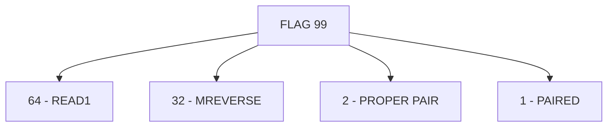

# Lecture 2 — SAM/BAM Format and samtools

> **Duration:** ~3 hours of reading + hands-on command line + Python.
> **Outcome:** You can read a SAM line column by column, decode a SAM FLAG bit by bit, parse a CIGAR string into operations, interpret a MAPQ value as a Phred-scaled error probability, and run the canonical `samtools sort | samtools index | samtools markdup | samtools depth` pipeline. By the end of this lecture you can produce a coverage plot and a duplicate-rate report from an aligned BAM without copy-pasting commands.

Lecture 1 explained the *algorithm* that produces alignments. Lecture 2 explains the *file format* those alignments live in and the toolchain you use to manipulate them.

If you only remember one thing from this lecture, remember this:

> **SAM is a plain-text tab-separated format with eleven mandatory columns per record and optional tag fields. BAM is the binary equivalent — same information, compressed with BGZF (Blocked GZIP) and indexable with a `.bai` for random access. CRAM is a further-compressed format that uses the reference itself to deduplicate the read sequence. `samtools` reads and writes all three. `pysam` is the Python wrapper that exposes the same API from inside your scripts. In daily work you spend 90% of your time on BAM files; SAM is for inspection, CRAM is for archival.**

---

## 1. The SAM specification, column by column

Open any SAM file in your terminal (`samtools view -h aln.bam | head`) and you will see two kinds of lines: header lines beginning with `@`, and alignment lines containing eleven tab-separated mandatory fields plus zero or more optional tags.

### 1.1 Header lines

Headers describe metadata about the file as a whole.

```
@HD     VN:1.6  SO:coordinate
@SQ     SN:NC_000913.3  LN:4641652
@RG     ID:SRR1770413   SM:ecoli_K12    LB:lib1    PL:ILLUMINA
@PG     ID:bwa  PN:bwa  VN:0.7.17       CL:bwa mem -t 4 -R @RG ...
@PG     ID:samtools     PN:samtools     VN:1.19    CL:samtools sort -@ 4 -
```

- **`@HD`** — header line. `VN` = SAM spec version (1.6 is current). `SO` = sort order (`unsorted`, `queryname`, `coordinate`).
- **`@SQ`** — one per reference sequence. `SN` = sequence name (matches `RNAME` in alignment lines). `LN` = sequence length in bp. Order must match the order of `@SQ` headers used during alignment (BWA enforces this strictly).
- **`@RG`** — read group. `ID` unique. `SM` = sample, `LB` = library, `PL` = platform. Multiple `@RG` lines per BAM are common when you have merged BAMs from multiple lanes or runs.
- **`@PG`** — program records, in pipeline order. Each tool that touched the BAM should append a `@PG`. The `CL` (command line) field is a record of how the BAM was produced — *read this when debugging*, it tells you exactly which version of which tool ran with which arguments.

### 1.2 Alignment lines — the eleven mandatory columns

| # | Name | Type | Meaning |
|---|------|------|---------|
| 1 | `QNAME` | string | Read name. Same for both ends of a paired-end pair. |
| 2 | `FLAG` | int | Bitwise FLAG (see §2). |
| 3 | `RNAME` | string | Reference sequence name (matches an `@SQ` `SN`). `*` if unmapped. |
| 4 | `POS` | int | 1-based leftmost position of the alignment on the reference. `0` if unmapped. |
| 5 | `MAPQ` | int | Mapping quality (see §3). |
| 6 | `CIGAR` | string | CIGAR string (see §4). `*` if unavailable. |
| 7 | `RNEXT` | string | Reference name of the mate. `=` if same as `RNAME`, `*` if unavailable. |
| 8 | `PNEXT` | int | 1-based position of the mate. `0` if unavailable. |
| 9 | `TLEN` | int | Template length (insert size). Positive for leftmost read of pair, negative for rightmost, `0` if not paired or info unavailable. |
| 10 | `SEQ` | string | Read sequence. `*` if not stored (e.g. hard-clipped supplementary). |
| 11 | `QUAL` | string | Phred+33 quality string, same length as `SEQ`. `*` if not stored. |

### 1.3 Optional tag fields — `XX:Y:value`

After column 11 the spec allows any number of `TAG:TYPE:VALUE` triples. `TAG` is two characters, `TYPE` is one character (`A` = character, `i` = integer, `f` = float, `Z` = string, `H` = hex). The common ones from BWA-MEM:

- **`NM:i:N`** — edit distance (number of mismatches + inserted + deleted bases).
- **`MD:Z:s`** — mismatch positions string (lets you reconstruct mismatches without the reference).
- **`AS:i:N`** — alignment score (raw, in BWA-MEM's scoring system).
- **`XS:i:N`** — suboptimal alignment score (second-best alignment). The gap between `AS` and `XS` drives MAPQ.
- **`SA:Z:loc1;loc2;...`** — supplementary alignment locations (chimeric reads).
- **`RG:Z:run1`** — read group identifier; cross-references the `@RG` header.

Tools that produce or consume specific tags document them in their manuals. For a comprehensive list see <https://samtools.github.io/hts-specs/SAMtags.pdf>.

### 1.4 A real SAM record

Here is a real BWA-MEM record from the mini-project dataset, broken across columns for legibility:

```
SRR1770413.42  99  NC_000913.3  150123  60  150M  =  150289  316
ACGTGCTACATGCTGAA...        FFFFFFFFFFFFFFFF...
NM:i:0  MD:Z:150  MC:Z:150M  AS:i:150  XS:i:0  RG:Z:SRR1770413
```

Reading column by column:

- `QNAME = SRR1770413.42` — the 42nd read pair in the SRR1770413 run.
- `FLAG = 99` = `0x1 + 0x2 + 0x20 + 0x40` — paired, properly paired, mate is reverse-complemented, this read is the first of the pair.
- `RNAME = NC_000913.3` — aligned to the *E. coli* MG1655 reference contig.
- `POS = 150123` — leftmost base of the alignment is at reference position 150,123 (1-based).
- `MAPQ = 60` — high-confidence unique placement (P_misalign ≤ 10^-6).
- `CIGAR = 150M` — 150 bases of alignment, no indels.
- `RNEXT = =` — mate is on the same reference contig.
- `PNEXT = 150289` — mate is at position 150,289.
- `TLEN = 316` — implied DNA fragment length is 316 bp (this read at 150123, mate at 150289 ending at 150289+150-1 = 150438; fragment spans 150123 to 150438 = 316 bp).
- `SEQ` and `QUAL` — 150-character read sequence and Phred+33 quality string.
- `NM:i:0` — zero edit distance (perfect match).
- `MD:Z:150` — 150 bases of match (no mismatches to encode).
- `AS:i:150` — alignment score 150 (BWA's default match=1, so 150 = perfect 150 bp match).
- `XS:i:0` — no second-best alignment found (the read maps uniquely).
- `RG:Z:SRR1770413` — read-group reference.

A healthy paired-end Illumina dataset is dominated by records like this. Reads that look weird — soft-clipped, MAPQ < 30, NM > 5, secondary alignments — are the interesting ones.

---

## 2. The FLAG field — decoding the bit field

`FLAG` is a 12-bit integer where each bit encodes one boolean property of the read. Add the bits to combine.

| Hex | Decimal | Symbol | Meaning |
|----:|--------:|--------|---------|
| `0x1` | 1 | `PAIRED` | Read is paired |
| `0x2` | 2 | `PROPER_PAIR` | Properly paired |
| `0x4` | 4 | `UNMAP` | Read unmapped |
| `0x8` | 8 | `MUNMAP` | Mate unmapped |
| `0x10` | 16 | `REVERSE` | Read reverse-complemented |
| `0x20` | 32 | `MREVERSE` | Mate reverse-complemented |
| `0x40` | 64 | `READ1` | First in pair |
| `0x80` | 128 | `READ2` | Second in pair |
| `0x100` | 256 | `SECONDARY` | Secondary alignment |
| `0x200` | 512 | `QCFAIL` | Failed vendor QC |
| `0x400` | 1024 | `DUP` | PCR/optical duplicate |
| `0x800` | 2048 | `SUPPLEMENTARY` | Supplementary (chimeric) |

### 2.1 Decoding `FLAG = 99` by hand

```
99 = 64 + 32 + 2 + 1
   = 0x40 + 0x20 + 0x2 + 0x1
   = READ1 + MREVERSE + PROPER_PAIR + PAIRED
```

So FLAG 99 is: this is the first read of a properly-paired pair, and the mate is reverse-complemented (which makes biological sense — if the first read is on the forward strand and the mate is on the reverse strand, the pair points "inward," which is the expected Illumina FR orientation).


*FLAG 99 decomposes into four bit flags that sum to its value.*

### 2.2 Decoding `FLAG = 147` by hand

```
147 = 128 + 16 + 2 + 1
    = 0x80 + 0x10 + 0x2 + 0x1
    = READ2 + REVERSE + PROPER_PAIR + PAIRED
```

So FLAG 147 is the second read of the same properly-paired pair, on the reverse strand. 99 + 147 is the textbook pair of FLAGs for healthy paired-end reads.

### 2.3 The samtools filter idiom

`samtools view -f INT` *requires* the bits in `INT` to be set. `samtools view -F INT` *excludes* records where any bit in `INT` is set. Common idioms:

```bash
# Mapped, primary, non-duplicate reads:
samtools view -F 0x904 aln.bam       # 0x904 = 0x4 | 0x100 | 0x800 = unmapped, secondary, supplementary
# (We also want to exclude duplicates and QC-fail:)
samtools view -F 0xF04 aln.bam       # 0xF04 = 0x4 | 0x100 | 0x200 | 0x400 | 0x800

# Properly paired only:
samtools view -f 0x2 -F 0x900 aln.bam

# Just unmapped reads (e.g., to investigate contamination):
samtools view -f 0x4 aln.bam | head
```

The Broad's "explain flags" web tool at <https://broadinstitute.github.io/picard/explain-flags.html> is the standard reference when you cannot remember a bit combination. Bookmark it.

---

## 3. MAPQ — the Phred-scaled mapping quality

MAPQ is a single integer encoding "how confident is the aligner that this is the correct placement?" on a Phred scale: `MAPQ = -10·log10(P[wrong placement])`.

| MAPQ | P_wrong | What this typically means |
|-----:|--------:|---------------------------|
| 60 | 10^-6 | BWA-MEM ceiling. Unique placement; second-best alignment ≥ 10 score points worse. |
| 40 | 10^-4 | Good unique placement; some other position is plausible but much worse. |
| 30 | 10^-3 | Reasonable; second-best is within ~5 points. |
| 20 | 10^-2 | Marginal; multiple positions about equally plausible. |
| 10 | 10^-1 | Poor; many candidates. |
| 1–9 | 10^-1 to 1 | Very poor. |
| 0 | 1 | Multimapper. Read aligned equally well to ≥ 2 positions; the aligner declines to choose. |

Critical caveats once more:

- **MAPQ is per-aligner**: BWA-MEM caps at 60, minimap2 at 60, bowtie2 at 42, STAR at 255-with-special-meaning. When reporting "MAPQ ≥ 30", *name the aligner* so a reader knows the scale.
- **MAPQ = 0 does not mean the alignment is wrong**: it means the aligner cannot pick between equally-good positions. The alignment is fine; the *uniqueness* is not. Variant callers typically discard MAPQ-0 reads because their position is ambiguous.
- **High MAPQ ≠ high CIGAR quality**: a read can have MAPQ 60 (unique placement) and CIGAR `50M5I95M` (5 bp insertion). The placement is confident; the read still has indels.

### 3.1 The samtools MAPQ filter

```bash
# Reads with MAPQ ≥ 30:
samtools view -q 30 aln.bam | wc -l

# Variant-calling-grade reads (MAPQ ≥ 30, proper pairs, no duplicates):
samtools view -bq 30 -f 0x2 -F 0x904 aln.bam > aln.q30.bam
```

For variant calling, MAPQ ≥ 30 is the conservative default. For coverage QC, count all alignments; the MAPQ distribution is itself a QC metric (a healthy run is bimodal at 0 and 60, with most reads at 60).

---

## 4. CIGAR — the alignment string

CIGAR (Compact Idiosyncratic Gapped Alignment Report) is a run-length-encoded list of `(length, op)` pairs describing how the read aligns to the reference. The string `36M2I12M1D80M` decodes to: 36 bases of match-or-mismatch, then 2 bases inserted (in read, not in reference), then 12 more bases of match-or-mismatch, then 1 base deleted (in reference, not in read), then 80 more bases of match-or-mismatch.

| Op | Long name | Consumes read? | Consumes ref? | Notes |
|----|-----------|:-:|:-:|-------|
| `M` | Alignment match | yes | yes | Match or mismatch — does not distinguish. Common. |
| `I` | Insertion to reference | yes | no | Read has bases not in reference. |
| `D` | Deletion from reference | no | yes | Reference has bases not in read. |
| `N` | Skipped region from reference | no | yes | E.g. an intron in RNA-seq. |
| `S` | Soft clip | yes | no | Bases in read at end, not aligned; still in `SEQ`. |
| `H` | Hard clip | no | no | Bases at read end not in `SEQ` at all. Common in supplementary alignments. |
| `P` | Padding | no | no | Silent deletion (rare). |
| `=` | Sequence match | yes | yes | Modern aligners emit when asked. |
| `X` | Sequence mismatch | yes | yes | Modern aligners emit when asked. |

### 4.1 Parsing CIGAR in pure Python

```python
import re

CIGAR_RE = re.compile(r"(\d+)([MIDNSHP=X])")

def parse_cigar(cigar: str) -> list[tuple[int, str]]:
    """Return list of (length, op) tuples."""
    return [(int(n), op) for n, op in CIGAR_RE.findall(cigar)]

def read_length_from_cigar(cigar: str) -> int:
    """Number of bases consumed from the query (SEQ)."""
    return sum(length for length, op in parse_cigar(cigar) if op in "MIS=X")

def ref_span_from_cigar(cigar: str) -> int:
    """Number of bases consumed from the reference."""
    return sum(length for length, op in parse_cigar(cigar) if op in "MDN=X")
```

For `cigar = "36M2I12M1D80M"`:

- `parse_cigar` → `[(36, 'M'), (2, 'I'), (12, 'M'), (1, 'D'), (80, 'M')]`
- `read_length_from_cigar` → `36 + 2 + 12 + 80 = 130`
- `ref_span_from_cigar` → `36 + 12 + 1 + 80 = 129`

If the read is 150 bp but the CIGAR length sums to 130, the difference is *unaccounted-for clipping* — usually a missing `20S` (soft clip) at one end. A read that claims `150M` but has `len(SEQ) = 130` is a malformed record; modern BWA emits these correctly.

### 4.2 pysam exposes CIGAR as a list of integer tuples

```python
import pysam

af = pysam.AlignmentFile("aln.bam", "rb")
for read in af.fetch("NC_000913.3", 0, 1000):
    # cigartuples is [(op_code, length), ...]
    # op_code: 0=M, 1=I, 2=D, 3=N, 4=S, 5=H, 6=P, 7==, 8=X
    print(read.query_name, read.cigarstring, read.cigartuples)
```

The integer codes (`0..8`) are defined in `pysam.CMATCH`, `pysam.CINS`, `pysam.CDEL`, etc. Use the symbolic names rather than magic numbers.

---

## 5. Sorting and indexing

A SAM/BAM file is produced by the aligner in *unsorted* order — reads come out roughly in the order they were submitted, which for paired-end Illumina data is roughly read-name order interleaved. For downstream tools to work, we need **coordinate-sorted** BAM (sorted by `RNAME` then `POS`) with an index.

### 5.1 Sort

```bash
# Coordinate sort (the common case):
samtools sort -@ 4 -o aln.sorted.bam aln.unsorted.bam

# Name sort (used as intermediate for fixmate/markdup):
samtools sort -n -@ 4 -o aln.namesorted.bam aln.unsorted.bam

# Sort piped from stdin:
bwa mem ... | samtools sort -@ 4 -o aln.sorted.bam -
```

`-@ N` is the thread count for compression. The sort itself is single-threaded; the bottleneck is BAM compression and that parallelizes well.

For a 2 GB BAM, sorting takes ~3 minutes with 4 threads and uses ~6 GB of RAM for temporary buffers. Sorts that need more RAM than available spill to disk (controlled by `-m` per-thread memory and `-T` temp prefix).

### 5.2 Index

```bash
samtools index aln.sorted.bam
# Produces aln.sorted.bam.bai
```

The `.bai` is a binary index over the BAM's coordinate ranges. It lets you do `samtools view aln.bam chr1:1000000-2000000` in milliseconds (binary search to the right offset) instead of streaming the whole BAM.

**Without the `.bai`, `pysam.AlignmentFile.fetch()` errors out, `samtools depth -r region` errors out, `bcftools mpileup` errors out**. The index is required, not optional. Always re-index after re-sorting.

### 5.3 Sort order in the header

```
@HD     VN:1.6  SO:coordinate
```

The `SO:` field records the sort order (`unsorted`, `queryname`, `coordinate`). Tools that depend on coordinate sort (variant callers, coverage tools) check this header and refuse to run on unsorted input. If you ever see "BAM is not sorted" errors, check the `@HD` line first — sometimes a BAM is coordinate-sorted but the `SO:` field was not updated (rare but possible).

---

## 6. Duplicate marking — the canonical samtools idiom

PCR duplicates arise when the library prep amplification step makes multiple copies of the same original DNA fragment. Optical duplicates arise when adjacent flow-cell features are mis-clustered as separate spots. Both produce reads that align to the same 5' position with the same orientation, and both inflate apparent coverage without adding biological information.

`samtools markdup` flags duplicates based on the 5' alignment position of each read pair, accounting for soft clipping. It does not require comparing the read sequences themselves — duplicates are detected positionally.

### 6.1 The four-step idiom

`samtools markdup` requires that mate-coordinate fields (`PNEXT`, `MC` tag, `ms` tag) are populated correctly. Most BAMs out of `bwa mem` have `PNEXT` set but not `ms`; the canonical fix is to name-sort, run `fixmate -m`, coordinate-sort, then markdup:


*The canonical samtools idiom for marking duplicates requires two sorts bracketing fixmate and markdup.*

```bash
# Step 1: name-sort (so mates are adjacent).
samtools sort -n -@ 4 -o aln.namesorted.bam aln.coordsorted.bam

# Step 2: fixmate with -m (add ms tags for markdup).
samtools fixmate -m aln.namesorted.bam aln.fixmate.bam

# Step 3: coordinate-sort again (markdup wants coord-sorted).
samtools sort -@ 4 -o aln.fixmate.coordsorted.bam aln.fixmate.bam

# Step 4: mark duplicates.
samtools markdup -s aln.fixmate.coordsorted.bam aln.markdup.bam

# Step 5: re-index.
samtools index aln.markdup.bam
```

The `-s` flag prints a statistics summary including the duplicate count and rate. A healthy mini-project run reports ~10–20% duplication; > 40% means the library was over-amplified and the run has low complexity.

### 6.2 Mark vs remove

By default, `samtools markdup` (and `picard MarkDuplicates`) *marks* duplicates with the `0x400` FLAG bit and leaves them in the BAM. Variant callers ignore them at the variant step; coverage tools choose whether to count or skip them.

To *remove* duplicates entirely, add `-r`:

```bash
samtools markdup -r aln.fixmate.coordsorted.bam aln.nodup.bam
```

For most pipelines, prefer marking (default) over removing. Marking preserves the data for QC purposes — a sudden spike in duplicate rate is often the first sign of a library prep problem, and you cannot diagnose what you have thrown away.

### 6.3 What markdup does not catch

`samtools markdup` is **position-based**. It catches:

- PCR duplicates with identical 5' coordinates.
- Optical duplicates (positionally adjacent on the flow cell), with the `-d` flag enabled.

It does not catch:

- Duplicates of sequences from different starting positions (which arise from mechanical shearing, not PCR — these are biologically informative).
- Adapter dimers (those are filtered by `fastp` or `cutadapt` upstream, before alignment).
- Reads from different libraries that happen to align to the same position (treated as biological replicates by markdup — and that is correct behavior).

For Unique Molecular Identifiers (UMIs) — a more aggressive duplicate strategy that compares the molecular-barcode tag — use `umi_tools dedup` or `gencore` instead of (or in addition to) `samtools markdup`. UMIs are out of scope for Week 5; we will revisit them in Week 7's RNA-seq context.

---

## 7. Computing coverage

Coverage is the number of reads spanning each reference position. It is the primary QC metric for any alignment — if your coverage is wildly uneven or has unexpected gaps, your downstream variant calls or expression estimates will inherit those problems.

### 7.1 `samtools depth` — per-position

```bash
# Per-position depth across all positions (including zero-coverage):
samtools depth -a aln.markdup.bam > depth.tsv
# Output: three columns per line: contig, position (1-based), depth.

# Mean coverage across all positions:
samtools depth -a aln.markdup.bam | awk '{sum+=$3; n++} END {print sum/n}'

# Coverage at a specific region:
samtools depth -a -r NC_000913.3:1000000-1001000 aln.markdup.bam
```

The `-a` flag includes positions with zero coverage. Without it, `samtools depth` only reports positions with at least one read — which means a coverage histogram computed without `-a` will be biased upward by the missing zeros. **Always use `-a`** unless you specifically know what you are doing.

### 7.2 `samtools coverage` — per-contig summary

```bash
samtools coverage aln.markdup.bam
# Output: TSV with one row per contig and columns:
#   rname, startpos, endpos, numreads, covbases, coverage, meandepth, meanbaseq, meanmapq
```

`coverage` (the column) is the fraction of bases with at least one read; `meandepth` is the average depth across the contig. For a healthy whole-genome alignment, `coverage` should be > 99% for the main reference contig and `meandepth` should be close to the expected value.

### 7.3 `pysam` for programmatic per-position depth

```python
import pysam
import numpy as np

bam = pysam.AlignmentFile("aln.markdup.bam", "rb")
contig = bam.references[0]
length = bam.lengths[0]
depth = np.zeros(length, dtype=np.int32)

# Per-position pileup. The truncate=True flag restricts to [start, stop).
for column in bam.pileup(contig, 0, length, truncate=True):
    depth[column.reference_pos] = column.nsegments

print(f"Mean depth: {depth.mean():.2f}")
print(f"Median depth: {np.median(depth):.1f}")
print(f"Stddev: {depth.std():.2f}")
print(f"Coefficient of variation: {depth.std()/depth.mean():.3f}")
print(f"Bases with depth = 0: {(depth == 0).sum()}")
print(f"Bases with depth >= 20: {(depth >= 20).sum()}")
```

On a 4.6 Mb E. coli BAM at 47x mean depth, this runs in ~30 seconds. For a human-genome BAM the right approach is `samtools depth -a` piped to a TSV reader — `pysam.pileup` is too slow at human-genome scale.

### 7.4 A coverage plot in matplotlib

```python
import matplotlib.pyplot as plt
import numpy as np

# depth is an np.ndarray from §7.3.
window = 10000  # 10 kb windows
n_windows = len(depth) // window
windowed = depth[: n_windows * window].reshape(n_windows, window).mean(axis=1)

fig, ax = plt.subplots(figsize=(12, 4))
ax.plot(np.arange(n_windows) * window / 1e6, windowed, linewidth=0.8)
ax.axhline(windowed.mean(), color="gray", linestyle="--", label=f"mean = {windowed.mean():.1f}x")
ax.set_xlabel("Reference position (Mb)")
ax.set_ylabel("Mean coverage (10 kb windows)")
ax.set_title("E. coli K-12 MG1655 — SRR1770413 coverage (after duplicate marking)")
ax.legend()
fig.tight_layout()
fig.savefig("coverage.png", dpi=150)
```

The plot should be roughly flat at the mean depth with small fluctuations due to GC content and mappability. Sharp dips correspond to repetitive regions (rRNA operons in E. coli give a characteristic 4-6 dips at 5x or below). Sharp spikes correspond to high-copy regions (multi-copy genes, integrated phages).

---

## 8. The full FASTQ → coverage-plot pipeline in one block

For reference, here is the full Week 5 mini-project pipeline:

```bash
#!/usr/bin/env bash
set -euo pipefail

REF=ref/ecoli.fa
R1=reads/SRR1770413_1.fq.gz
R2=reads/SRR1770413_2.fq.gz
OUT=aln/SRR1770413

mkdir -p ref reads aln results

# 1. Index reference (one-time).
[ -e "${REF}.bwt" ] || bwa index "${REF}"
[ -e "${REF}.fai" ] || samtools faidx "${REF}"

# 2. Align + coordinate-sort.
bwa mem -t 4 \
  -R "@RG\tID:SRR1770413\tSM:ecoli_K12\tLB:lib1\tPL:ILLUMINA" \
  "${REF}" "${R1}" "${R2}" \
| samtools sort -@ 4 -o "${OUT}.sorted.bam" -

# 3. Name-sort → fixmate → coord-sort → markdup.
samtools sort -n -@ 4 "${OUT}.sorted.bam" \
| samtools fixmate -m - - \
| samtools sort -@ 4 - \
| samtools markdup -s - "${OUT}.markdup.bam"
samtools index "${OUT}.markdup.bam"

# 4. QC summaries.
samtools flagstat "${OUT}.markdup.bam" > results/flagstat.txt
samtools coverage "${OUT}.markdup.bam" > results/coverage_summary.tsv
samtools depth -a "${OUT}.markdup.bam" | gzip > results/depth.tsv.gz

# 5. Coverage plot.
python scripts/plot_coverage.py \
  --depth results/depth.tsv.gz \
  --window 10000 \
  --out results/coverage.png
```

That is the pipeline. Memorize the *shape*, not the exact flags — when the mini-project asks you to produce a coverage plot from SRR1770413, you should be able to write this script from scratch.

---

## 9. Common misconceptions

A short list of "things that seem right but are not":

- **"BAM is just SAM compressed with gzip."** No. BAM uses BGZF (Blocked GZIP), which is gzip-compatible but compresses in independent 64 KB blocks. The block structure is what enables random access via `.bai` — you cannot seek to a position inside a regular gzip file, but you can in a BGZF.
- **"`samtools view` defaults to BAM output."** No. `samtools view` defaults to SAM (text) output. Use `samtools view -b` for BAM. Forgetting `-b` and piping to disk fills your disk with uncompressed SAM, which is ~3-5x larger than BAM.
- **"MAPQ 0 means the read did not align."** No. MAPQ 0 means it aligned to ≥ 2 positions equally well. To check unmapped status, look at the `0x4` FLAG bit, not MAPQ.
- **"Duplicate removal is the same as duplicate marking."** No. Marking sets the `0x400` FLAG and keeps the read; removing deletes the read from the BAM. The defaults are *marking*, and downstream tools respect the flag. Removing is a one-way operation; do not do it unless you have a specific reason.
- **"Coverage = number of reads / reference length."** Approximately, but not exactly. Mean coverage = `(total aligned bases) / (reference length)`, where total aligned bases is the sum of `ref_span_from_cigar` over all primary alignments. The "number of reads × read length" approximation breaks down when there are many soft-clipped reads or when reads are different lengths.

If any of these surprised you, re-read sections 1, 3, 6, and 7.

---

## 10. Where this lecture lands you for the mini-project

After Lecture 2 you should be able to:

- Read a SAM line column by column and explain each field.
- Decode any FLAG bit field by hand or with `samtools view`'s built-in tools.
- Read a CIGAR string and compute the implied query/reference spans.
- Interpret a MAPQ value on the Phred scale.
- Run the canonical FASTQ → markdup BAM pipeline with the right flag set.
- Compute and plot coverage with `samtools depth` and matplotlib.

The mini-project takes a real SRA dataset and walks you through all of this end to end, on a small genome where the full pipeline runs in under 10 minutes. The challenge asks you to compute the duplication rate yourself (from the 5' positions) and compare to `samtools markdup`'s answer. The homework drills the SAM/CIGAR/FLAG parsing until it is reflex.

---

## Self-check questions

Before you move on, answer these without looking:

1. List the eleven mandatory SAM columns in order. (§1.2)
2. Decode `FLAG = 99` and `FLAG = 147` bit by bit. (§2)
3. State the MAPQ formula in terms of misalignment probability. (§3)
4. Parse the CIGAR `120M2I20M3S` — what are the query length and reference span? (§4.1)
5. Why is `samtools fixmate -m` required *before* `samtools markdup`? (§6.1)
6. What does `-F 0x904` filter? Why is it a common variant-calling filter? (§2.3)
7. Why is `samtools depth -a` (with the `-a` flag) preferred over `samtools depth` for coverage QC? (§7.1)
8. Distinguish *marking* duplicates from *removing* them. Which is the default and why? (§6.2)
9. What does the `SO:coordinate` field in the `@HD` header guarantee about a BAM? (§5.3)
10. Why is a `.bai` index required for `pysam.AlignmentFile.fetch()`? (§5.2)

Answers are not provided. If you struggle, the answers are in the section references; do the work.

---

## Further reading

- The SAM/BAM/CRAM format specification: <https://samtools.github.io/hts-specs/SAMv1.pdf>.
- The samtools tutorial: <http://www.htslib.org/doc/samtools.html>.
- Heng Li's blog on samtools / BWA / minimap2: <https://lh3.github.io/>.
- The pysam documentation: <https://pysam.readthedocs.io/>.
- Picard MarkDuplicates documentation (the GATK ecosystem equivalent of samtools markdup): <https://broadinstitute.github.io/picard/picard-metric-definitions.html#MarkDuplicates>.
- The Broad's "explain flags" decoder: <https://broadinstitute.github.io/picard/explain-flags.html>.

---

*You have now covered both lectures. Continue to [Exercise 1 — Align a small genome](../exercises/exercise-01-align-small-genome.py) for the hands-on work that ties it all together.*
