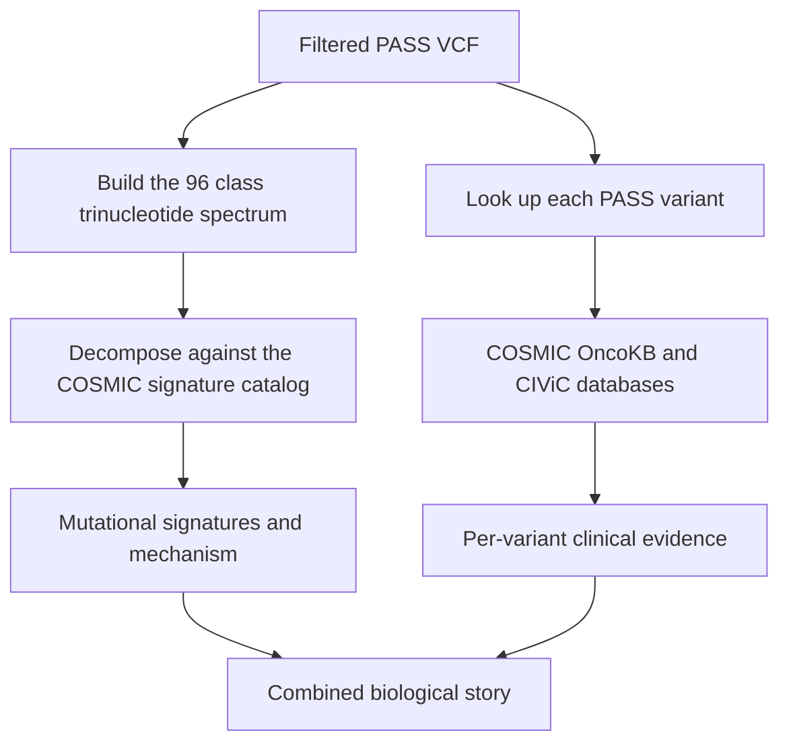

# Lecture 3 — Mutational Signatures and the COSMIC / OncoKB / CIViC Interpretation Layer

> **Educational and research use only.** Mutational signatures and clinical-interpretation databases inform research-grade hypotheses about a tumor's biology. They do not replace a clinical lab. Do not use Week 11 output to guide treatment.

## 1. From a VCF to a story about the tumor

Lecture 2 produced a filtered VCF: a list of somatic SNVs and indels, each annotated with FILTER reason, allele frequency, and depth. The PASS subset is the input to the interpretation layer. Two complementary moves from there:

- **Mutational signatures.** Stack the 96-class trinucleotide spectrum of the PASS SNVs and decompose it into the COSMIC v3.3 reference catalog. The output is a fractional contribution per signature ("70% SBS1 + SBS5, 20% SBS18, 10% other"); the contributions name the mutational processes that have been active in the tumor (clock-like methylation deamination, reactive oxygen damage, UV, tobacco, mismatch-repair deficiency, homologous-recombination deficiency, etc.). This is **mechanism** — what made the mutations.
- **Variant-level interpretation.** Look up the individual PASS variants in COSMIC, OncoKB, and CIViC. The output is a list of variants with evidence levels ("TP53 R175H — OncoKB Level 3B; CIViC: predictive evidence; COSMIC: recurrent across pan-cancer with > 3,000 mutated samples"). This is **per-variant clinical context**.


*The two complementary interpretation paths from a filtered VCF, converging on the mini-project's biological story.*

Both moves are research-grade interpretations. Neither replaces a clinical lab. But each tells you something useful: signatures tell you *why* the tumor accumulated mutations the way it did; variant-level lookup tells you *which* of the mutations have known clinical correlates.

## 2. The 96-class trinucleotide spectrum

The Alexandrov-lab encoding of a single-base substitution is the **trinucleotide context**: the base before the substitution, the substituted base, and the base after. With six substitution types after normalizing to the pyrimidine reference (C>A, C>G, C>T, T>A, T>C, T>G) and four possible flanking bases on each side, the total is 6 * 4 * 4 = 96 classes.

The convention to remember:

- Every mutation is written with the **pyrimidine** reference: if the reference is A or G, flip the variant to its reverse complement so the reference becomes C or T. A G>A mutation in context ACG becomes a C>T mutation in context CGT (the reverse complement).
- The class label is `(left_flank)[REF>ALT](right_flank)`, e.g. `A[C>T]G` is "C>T in trinucleotide ACG".
- The order of the 96 classes is conventionally: six substitution types in order (C>A, C>G, C>T, T>A, T>C, T>G), and within each type 16 trinucleotide contexts in order ACA, ACC, ACG, ACT, CCA, CCC, CCG, CCT, GCA, GCC, GCG, GCT, TCA, TCC, TCG, TCT. The standard plotting order is in this nested loop.

Computing the spectrum for a tumor:

```python
from typing import Counter
from pathlib import Path
import pysam

COMPLEMENT: dict[str, str] = {"A": "T", "T": "A", "C": "G", "G": "C"}
SUBSTITUTION_TYPES: list[str] = ["C>A", "C>G", "C>T", "T>A", "T>C", "T>G"]
BASES_ORDERED: list[str] = ["A", "C", "G", "T"]


def reverse_complement(s: str) -> str:
    return "".join(COMPLEMENT[b] for b in reversed(s))


def normalize_to_pyrimidine(ref: str, alt: str, context: str) -> tuple[str, str, str]:
    if ref in {"C", "T"}:
        return (ref, alt, context)
    return (COMPLEMENT[ref], COMPLEMENT[alt], reverse_complement(context))


def trinucleotide_class(
    chrom: str, pos: int, ref: str, alt: str, reference_fasta: pysam.FastaFile,
) -> str:
    """Return the 96-class label like 'A[C>T]G'. 1-based pos.

    Raises ValueError on multi-base ref/alt or out-of-range positions.
    """
    if len(ref) != 1 or len(alt) != 1:
        raise ValueError("trinucleotide_class is SNV-only")
    flanks: str = reference_fasta.fetch(chrom, pos - 2, pos + 1).upper()
    if len(flanks) != 3:
        raise ValueError(f"could not fetch trinucleotide at {chrom}:{pos}")
    norm_ref, norm_alt, norm_context = normalize_to_pyrimidine(ref, alt, flanks)
    return f"{norm_context[0]}[{norm_ref}>{norm_alt}]{norm_context[2]}"
```

The output `'A[C>T]G'` slot increments the spectrum counter at the position for that class. Across all PASS SNVs in a tumor, the spectrum is a 96-element vector.

## 3. Building the 96-element spectrum

```python
from collections import Counter

def build_spectrum(
    variants: list[tuple[str, int, str, str]],
    reference_fasta_path: Path,
) -> Counter:
    counts: Counter = Counter()
    with pysam.FastaFile(str(reference_fasta_path)) as fasta:
        for chrom, pos, ref, alt in variants:
            if len(ref) != 1 or len(alt) != 1:
                continue  # skip indels
            cls: str = trinucleotide_class(chrom, pos, ref, alt, fasta)
            counts[cls] += 1
    return counts
```

The result is a `Counter` keyed on the 96 class labels. A typical bulk tumor at whole-genome coverage produces ~2,000-20,000 SNVs (depending on tumor type and mutational load); a hypermutator (mismatch-repair deficient, POLE-mutated) can produce 50,000+. A whole-exome run produces 30-300 SNVs per tumor; this is too few for a robust signature decomposition. The Week 11 didactic dataset is small enough that the spectrum is noisy; we discuss the count-vs-signal trade-off in §7.

For SigProfilerAssignment input, the canonical format is a tab-separated file:

```text
Mutation Types  TUMOR_SAMPLE
A[C>A]A         3
A[C>A]C         1
...             ...
T[T>G]T         5
```

with all 96 rows present (zeros for unobserved classes).

## 4. The COSMIC v3 signature catalog

The COSMIC v3.3 SBS signature catalog (Alexandrov et al. 2020, *Nature* 578:94; free at <https://www.ncbi.nlm.nih.gov/pmc/articles/PMC7054213/>) is a 96-by-78 matrix: 96 trinucleotide classes by 78 SBS signatures. Each column is one signature; each entry is the probability that a mutation of that class is generated by that signature. The columns sum to 1.

The canonical signatures and their biological associations (a non-exhaustive list — the COSMIC documentation has the full set):

| Signature | Aetiology / mechanism | Typical cancer types |
|-----------|-----------------------|----------------------|
| SBS1 | 5-methylcytosine deamination; clock-like with age | All tumor types; age-correlated |
| SBS2 | APOBEC cytidine deaminase activity | Bladder, cervix, breast |
| SBS3 | Homologous-recombination deficiency (BRCA-pathway loss) | Breast, ovarian, pancreatic |
| SBS4 | Tobacco smoking | Lung, head and neck |
| SBS5 | Clock-like; unknown source | All tumor types |
| SBS6 | Mismatch-repair deficiency (MSI) | Colorectal, endometrial |
| SBS7a/b/c/d | UV light exposure | Skin (melanoma, squamous) |
| SBS9 | POLH polymerase activity | Lymphoid; SHM-associated |
| SBS10a/b | POLE polymerase exonuclease deficiency | Hypermutated tumors |
| SBS13 | APOBEC cytidine deaminase activity (different variety) | Bladder, cervix, breast |
| SBS15 | Mismatch-repair deficiency | Colorectal, stomach |
| SBS18 | Reactive oxygen damage | Various |
| SBS20 | MMR deficiency + concurrent POLD1 mutation | Colorectal |
| SBS22 | Aristolochic acid | Liver, urothelial |
| SBS24 | Aflatoxin | Liver |
| SBS26 | MMR deficiency | Colorectal, endometrial |
| SBS29 | Tobacco chewing | Oral |
| SBS31 | Platinum chemotherapy | Treated tumors |
| SBS35 | Platinum chemotherapy | Treated tumors |
| SBS36 | MUTYH base-excision repair deficiency | Colorectal |
| SBS39 | Unknown | (often co-linear with SBS3; degenerate) |

The full catalog with mechanistic notes is at <https://cancer.sanger.ac.uk/signatures/sbs/>.

## 5. The decomposition: non-negative least squares

The decomposition problem is: given the 96-element observed spectrum `o` and the 96-by-78 signature matrix `S`, find the 78-element exposure vector `w` (with `w_i >= 0`) that minimizes the reconstruction error `||o - S * w||` while penalizing the use of too many signatures.

```text
o  =  S  *  w  +  residual

[ 96x1 ] = [ 96x78 ] * [ 78x1 ] + [ 96x1 ]
```

The constraints: `w_i >= 0` (a signature cannot contribute negatively) and typically `sum(w) = total_mutations` (the decomposition accounts for every mutation). The optimization is **non-negative least squares (NNLS)**. SigProfilerAssignment adds:

- A **sparsity** prior (most tumors have only 2-5 active signatures; the prior discourages putting weight on many signatures).
- A **cross-validation** step for stability (the data is bootstrap-resampled and the decomposition is repeated; signatures that appear consistently across resamples are reported with higher confidence).
- A **cosine similarity** report between the observed spectrum and the reconstructed spectrum `S * w`; values above 0.85 are considered good fits, above 0.95 are excellent.

deconstructSigs (Rosenthal et al. 2016, *Genome Biology* 17:31) uses an older iterative least-squares approach with a similar cosine-similarity check. It is widely used in published papers and ships an R package with a Python wrapper.

The Week 11 pipeline uses SigProfilerAssignment because it is Python-native and ships the COSMIC v3.3 catalog directly.

## 6. Running SigProfilerAssignment

The canonical Python call:

```python
from SigProfilerAssignment import Analyzer
from pathlib import Path

def run_sigprofiler(
    spectrum_tsv: Path,
    out_dir: Path,
    genome_build: str = "GRCh38",
    cosmic_version: str = "3.3",
) -> Path:
    out_dir.mkdir(parents=True, exist_ok=True)
    Analyzer.cosmic_fit(
        samples=str(spectrum_tsv),
        output=str(out_dir),
        input_type="matrix",
        context_type="96",
        genome_build=genome_build,
        cosmic_version=cosmic_version,
    )
    return out_dir / "Assignment_Solution" / "Activities" / "Assignment_Solution_Activities.txt"
```

The output directory structure is:

```text
sigprofiler_out/
├── Assignment_Solution/
│   ├── Activities/
│   │   ├── Assignment_Solution_Activities.txt        # per-signature counts
│   │   └── Decomposed_Mutation_Probabilities.txt     # per-mutation signature probs
│   ├── Signatures/
│   │   └── Sample_Reconstruction.txt                 # reconstructed spectrum
│   └── Solution_Stats/
│       └── Assignment_Solution_Samples_Stats.txt     # cosine similarities
└── COSMIC_v3.3_SBS_GRCh38.csv                        # reference catalog used
```

The `Activities` file is a TSV with samples as rows and signatures as columns; each cell is the number of mutations attributed to that signature in that sample. The fractional contribution is `Activities[i,j] / sum(Activities[i, :])`.

The `Samples_Stats` file reports per-sample cosine similarity, total mutations, and the number of signatures with non-trivial weight (typically 3-7 for a real tumor).

## 7. The count-vs-signal trade-off and signature degeneracy

Mutational-signature decomposition needs **enough mutations**. The Alexandrov lab recommends at least 100 SNVs for a stable decomposition; below 50 the decomposition is dominated by noise and the cosine similarity is unreliable. The Week 11 didactic dataset (~200 PASS SNVs) is at the lower end; real whole-genome runs have 1,000-20,000 SNVs and the decomposition is much more stable.

A second issue is **signature degeneracy**. Some signatures have similar shapes — SBS3 (homologous-recombination deficiency) and SBS39 (unknown mechanism) are close enough in their 96-class spectra that NNLS struggles to separate them when the mutation count is low. SBS5 (clock-like, unknown) and SBS40 (clock-like, kidney-specific) are similarly co-linear. The reported solution may put weight on SBS39 when the true source is SBS3, or vice versa. SigProfilerAssignment's cross-validation step reports a confidence interval per signature; signatures with wide intervals should be reported as "either of {SBS3, SBS39}" rather than as a confident assignment.

When the cosine similarity is low (< 0.85), the decomposition has failed to fit a substantial fraction of the observed spectrum. This is informative: it may mean a novel signature is at work that COSMIC v3.3 does not cover, or it may mean the spectrum is too noisy to fit cleanly. Either way the report should name the residual fraction and the cosine similarity, not just the top signatures.

## 8. Interpreting the top signatures

A clean decomposition on a real tumor gives a result like:

```text
SBS1   contributing 22% of mutations  (clock-like, methylation)
SBS5   contributing 41% of mutations  (clock-like, unknown)
SBS3   contributing 21% of mutations  (HRD; BRCA-pathway loss)
SBS18  contributing 11% of mutations  (reactive oxygen)
others contributing 5%  of mutations
total                   1,847 SNVs
cosine similarity to reconstructed spectrum: 0.94
```

The interpretation:

- SBS1 + SBS5 together are the "background" of any tumor; their contribution scales with patient age. ~63% is in the normal range for a middle-aged patient.
- SBS3 at 21% suggests homologous-recombination deficiency. This is **actionable**: HRD tumors respond to PARP inhibitors (olaparib, niraparib, rucaparib). A pathologist would order BRCA1/2 sequencing and a homologous-recombination score (HRD score) on the clinical side; the signature decomposition is supporting evidence.
- SBS18 at 11% suggests reactive oxygen damage. Less specifically actionable but informs the mechanistic story.
- The cosine similarity of 0.94 is a good fit; the residual 5% may be noise or low-weight contributions from other signatures.

A failure case:

```text
SBS5   contributing 40% of mutations
SBS39  contributing 35% of mutations
SBS3   contributing 12% of mutations
SBS40  contributing 8%  of mutations
others 5%
cosine similarity: 0.78
```

The cosine of 0.78 is poor. The 35% on SBS39 is suspicious because SBS39 is "unknown mechanism" and is known to be degenerate with SBS3. The mini-project write-up has to flag this: "the signature attribution is ambiguous between SBS3 and SBS39; the cosine similarity to the COSMIC v3.3 reconstruction is below the 0.85 threshold; either the spectrum has too few mutations for a stable fit or a novel signature is at work."

## 9. The variant-level interpretation databases

After the signature layer, the per-variant interpretation layer. Three databases:

### COSMIC

The Catalogue Of Somatic Mutations In Cancer (Sondka et al. 2024, *Nucleic Acids Research* 52:D1210; free for academic use at <https://cancer.sanger.ac.uk/cosmic>). The canonical catalog of recurrent somatic variants. For each variant the database records: the number of tumor samples it has been observed in, the tissue distribution, the cancer types, the linked papers, and (for known driver mutations) the COSMIC Cancer Gene Census assignment.

A useful filter for a research pipeline: variants present in COSMIC's Cancer Gene Census list are *prior candidates* for being drivers. Variants present in COSMIC at >= 10 cancer samples are recurrent and worth a look. Variants absent from COSMIC are not necessarily passengers (rare drivers exist) but they are *less* likely to be drivers.

The COSMIC API is documented at <https://cancer.sanger.ac.uk/cosmic/help/api>; the bulk download requires academic registration.

### OncoKB

The Memorial Sloan Kettering knowledge base of oncogenic alterations (Chakravarty et al. 2017, *JCO Precision Oncology* 1:1; free at <https://www.oncokb.org/>). For each variant the database records:

- **Mutation Effect.** Loss-of-function, Gain-of-function, Switch-of-function, Likely Oncogenic, Inconclusive, Unknown.
- **FDA Evidence Level.** Level 1: FDA-approved biomarker in this tumor type for an approved therapy. Level 2: standard care biomarker. Level 3A: clinical evidence in this tumor type. Level 3B: clinical evidence in another tumor type. Level 4: biological evidence.
- **Linked drugs.** The targeted therapies for which the alteration is a biomarker.
- **Linked clinical trials.**

The public API at <https://api.oncokb.org/oncokb-website/api> requires a free token; the public-tier annotation covers the canonical list of clinically actionable alterations.

A typical lookup for `TP53 R175H` returns:

```text
Mutation Effect:    Loss-of-function
Oncogenic:          Yes
Level (highest):    3B  (Predictive biomarker in another tumor type)
Linked drugs:       APR-246 (in trials)
```

Note that TP53 is a tumor suppressor; Loss-of-function mutations are oncogenic in the sense that they remove a brake on tumorigenesis, not because they activate oncogene signalling. OncoKB's Mutation Effect terminology captures this.

### CIViC

The Clinical Interpretation of Variants In Cancer (Griffith et al. 2017, *Nature Genetics* 49:170; <https://civicdb.org/>). The Washington University community-curated database. Free, open, no registration required. For each variant the database records evidence items grouped into:

- **Predictive evidence.** Sensitivity / resistance to a therapy.
- **Prognostic evidence.** Effect on patient outcome.
- **Diagnostic evidence.** Effect on disease diagnosis.
- **Predisposing evidence.** Inherited risk (relevant for germline; the CIViC database covers both).
- **Functional evidence.** In-vitro or in-vivo characterization of the variant's effect.
- **Oncogenic evidence.** Whether the variant is oncogenic at all.

Each evidence item has a star-rating (1-5) reflecting confidence. CIViC's assertion-level summary combines evidence items into a per-variant assertion that the curators stand behind.

The TSV data dump at <https://civicdb.org/releases/main> is freely downloadable; the API is JSON over HTTPS at <https://docs.civicdb.org/en/latest/model/data_releases.html>.

## 10. The OncoKB / CIViC lookup pattern in Python

For Challenge 2, the lookup pattern is:

```python
import requests
from pathlib import Path
import time

def oncokb_lookup(
    hugo_symbol: str,
    alteration: str,
    token: str | None = None,
    timeout: float = 30.0,
) -> dict:
    """Look up a variant in OncoKB. Returns the JSON response.

    Raises requests.HTTPError on non-200 response.
    Returns an empty dict if the API call fails for any reason.
    """
    url = "https://www.oncokb.org/api/v1/annotate/mutations/byProteinChange"
    params = {"hugoSymbol": hugo_symbol, "alteration": alteration}
    headers = {"Accept": "application/json"}
    if token:
        headers["Authorization"] = f"Bearer {token}"
    try:
        resp = requests.get(url, params=params, headers=headers, timeout=timeout)
        resp.raise_for_status()
        return resp.json()
    except Exception as exc:
        print(f"[oncokb] lookup failed for {hugo_symbol} {alteration}: {exc}")
        return {}
```

A polite rate-limit: 1 request per second is well within the API's terms. For a batch of 100 PASS variants, the lookup takes ~2 minutes.

CIViC has a similar interface; the TSV dump approach is often easier than the API for batch lookups:

```python
import pandas as pd
from pathlib import Path

def civic_lookup_from_tsv(
    variants: list[tuple[str, str]],
    civic_tsv_path: Path,
) -> pd.DataFrame:
    """Look up (gene, alteration) pairs in a CIViC release TSV.

    Returns a DataFrame with one row per matching evidence item.
    """
    civic = pd.read_csv(civic_tsv_path, sep="\t", low_memory=False)
    civic["key"] = civic["gene"].str.upper() + "|" + civic["variant"].astype(str)
    target_keys: set[str] = {f"{g.upper()}|{a}" for g, a in variants}
    return civic[civic["key"].isin(target_keys)].copy()
```

The CIViC TSV is on the order of 5,000 evidence items; a hash-set match is microseconds per lookup.

## 11. What the interpretation layer does *not* do

Three things to be clear about:

- **The interpretation layer does not turn a research VCF into clinical advice.** The OncoKB and CIViC evidence levels are research-grade summaries of the published literature. A clinical lab maps them to specific therapies for specific patients via a validated pipeline; that pipeline includes additional review steps (variant classification by a molecular pathologist, MTB consensus, FDA-approved companion-diagnostic check). The research pipeline is upstream of all that.
- **The interpretation layer does not call variants.** It looks up variants that the caller has already produced. A variant that the caller missed will not appear in the lookup; the lookup will not save a missed call.
- **The interpretation layer can be wrong.** OncoKB and CIViC are curated by humans; entries can be outdated, conservative, or incomplete. CIViC has occasional duplicate entries; OncoKB sometimes lags the literature by months. The pipeline's write-up should name the database release dates and the date the lookup was run.

## 12. Combining signatures and variant-level evidence

The combined story for the mini-project's Markdown report:

- **Signature decomposition.** Top three signatures with fractional contributions and cosine similarity. Cite the COSMIC catalog version.
- **PASS variant list.** Filtered VCF with chrom, pos, REF, ALT, AF, the FILTER column, gene annotation (Funcotator / VEP), trinucleotide class.
- **Variant-level interpretation.** For each PASS variant in a known cancer-related gene (the COSMIC Cancer Gene Census), look up OncoKB and CIViC and report the evidence levels.
- **The biological story.** One paragraph that combines the signature evidence ("the signature decomposition suggests HRD") with the variant evidence ("a BRCA2 PASS variant in the tumor is in the COSMIC Cancer Gene Census; OncoKB reports Level 3A predictive evidence for PARP-inhibitor response").

The combined story is the mini-project's deliverable. It is a *research-grade* hypothesis, not a clinical report; it names what is known, what is supporting evidence, and what is missing.

## 13. The standard failure modes of the interpretation layer

- **Too few mutations.** A signature decomposition on < 50 SNVs is noise. A whole-exome tumor with 30 SNVs cannot reliably distinguish SBS1 + SBS5 from SBS3 + SBS18.
- **Signature degeneracy.** SBS3 vs SBS39, SBS5 vs SBS40. Report both as the candidate, not one as the answer.
- **Reference-build drift.** The COSMIC catalog is build-specific; passing a GRCh37 VCF to GRCh38 SigProfiler reference produces silently wrong trinucleotide contexts (the chromosomes and positions are wrong) and a meaningless decomposition.
- **OncoKB / CIViC outdated.** The literature moves faster than the curated databases; a Level 4 variant today may be Level 1 in six months. Pin the database release date.
- **Tumor-type mismatch.** OncoKB evidence levels depend on the tumor type; Level 1 in breast cancer may be Level 3B in lung. The pipeline should query with the tumor type, not anonymously.

## 14. References

- Alexandrov LB, Kim J, Haradhvala NJ, et al. *The repertoire of mutational signatures in human cancer.* **Nature** 578:94-101 (2020). Free at PMC: <https://www.ncbi.nlm.nih.gov/pmc/articles/PMC7054213/>.
- Rosenthal R, McGranahan N, Herrero J, et al. *deconstructSigs: delineating mutational processes in single tumors.* **Genome Biology** 17:31 (2016). Free at PMC: <https://www.ncbi.nlm.nih.gov/pmc/articles/PMC4762164/>.
- Sondka Z, Dhir NB, Carvalho-Silva D, et al. *COSMIC: a curated database of somatic variants and clinical data for cancer.* **Nucleic Acids Research** 52:D1210-D1217 (2024). Free at <https://academic.oup.com/nar/article/52/D1/D1210/7416441>.
- Chakravarty D, Gao J, Phillips SM, et al. *OncoKB: A Precision Oncology Knowledge Base.* **JCO Precision Oncology** 1:1-16 (2017). Free at PMC: <https://www.ncbi.nlm.nih.gov/pmc/articles/PMC5586540/>.
- Griffith M, Spies NC, Krysiak K, et al. *CIViC is a community knowledgebase for expert crowdsourcing the clinical interpretation of variants in cancer.* **Nature Genetics** 49:170-174 (2017). Free at PMC: <https://www.ncbi.nlm.nih.gov/pmc/articles/PMC5367263/>.
- ICGC / TCGA Pan-Cancer Analysis of Whole Genomes Consortium. *Pan-cancer analysis of whole genomes.* **Nature** 578:82-93 (2020). Free at PMC: <https://www.ncbi.nlm.nih.gov/pmc/articles/PMC7025898/>.

## 15. Self-check

You should be able to answer the following without looking back:

- Why is every mutation normalized to the pyrimidine reference for signature analysis?
- How many trinucleotide classes are there and how is the order canonicalized?
- What is non-negative least squares and why is the non-negativity constraint important here?
- Define the cosine similarity and state the threshold below which a decomposition is considered a poor fit.
- Why is SBS3 / SBS39 a degenerate pair, and how does SigProfilerAssignment communicate the ambiguity?
- What is the OncoKB Level 1 definition and how does it differ from Level 3B?
- Why is variant-level lookup not the same as clinical interpretation?
- What is the minimum recommended mutation count for a stable signature decomposition, and what should the pipeline do if the count is below that threshold?

If any of these are not crisp, re-read §2-§5 (the trinucleotide context, the decomposition math, the catalog), §7-§8 (the count-vs-signal trade-off, the interpretation), and §9-§11 (the variant-level layer).

---

Back to the [Week 11 README](../README.md), or go to [Exercise 1: Mutect2 via subprocess](../exercises/exercise-01-mutect2-via-subprocess.py).
